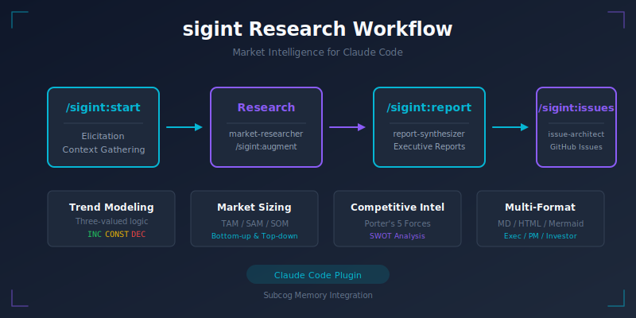

# sigint - Signal Intelligence

[](https://github.com/anthropics/claude-code)
[](LICENSE)
[](CHANGELOG.md)

Comprehensive market research toolkit for Claude Code with report generation, GitHub issue creation, and trend-based analysis.

<p align="center">
  
</p>

## Quick Start

```bash
# 1. Start research with a topic
/sigint:start AI-powered code review tools

# 2. Answer elicitation questions (decision context, audience, priorities)

# 3. Check progress
/sigint:status

# 4. Generate report
/sigint:report

# 5. Create GitHub issues (optional)
/sigint:issues
```

See [docs/quick-start.md](docs/quick-start.md) for a detailed walkthrough.

## Features

- **Iterative Research Workflow**: Start, refine, and finalize market research through commands
- **Multi-Audience Reports**: Generate reports for executives, PMs, investors, and developers
- **Trend-Based Modeling**: Three-valued logic analysis (INC/DEC/CONST) for uncertain data
- **GitHub Integration**: Automatically create sprint-sized issues from findings
- **Subcog Memory**: Persist research state across sessions
- **Multi-Format Output**: Markdown, HTML, Mermaid diagrams

## Installation

```bash
# Option 1: Plugin Marketplace (recommended)
/plugins add sigint

# Option 2: Local development
claude --plugin-dir /path/to/sigint

# Option 3: Manual install to plugins directory
cp -r sigint ~/.claude/plugins/
```

## Commands

| Command | Description |
|---------|-------------|
| `/sigint:start <topic>` | Begin new research session |
| `/sigint:augment <area>` | Deep-dive into specific area |
| `/sigint:update` | Refresh existing research data |
| `/sigint:report` | Generate comprehensive report |
| `/sigint:issues` | Create GitHub issues from findings |
| `/sigint:resume` | Resume previous research session |
| `/sigint:status` | Show current research state |
| `/sigint:init` | Manually initialize Subcog context |

## Agents

- **market-researcher**: Autonomous market research and data gathering
- **issue-architect**: Converts findings to sprint-sized GitHub issues
- **report-synthesizer**: Generates multi-format reports with visualizations

## Skills (Research Methodologies)

Each skill teaches AND executes the methodology:

1. **Competitive Analysis**: Porter's 5 Forces, competitor mapping
2. **Market Sizing**: TAM/SAM/SOM calculations
3. **Trend Analysis**: Macro/micro trend identification
4. **Customer Research**: Persona development, needs analysis
5. **Tech Assessment**: Technology evaluation, feasibility
6. **Financial Analysis**: Revenue models, unit economics
7. **Regulatory Review**: Compliance, legal considerations
8. **Report Writing**: Executive report best practices
9. **Trend Modeling**: Three-valued logic (INC/DEC/CONST), scenario graphs

## Report Structure

Reports include:
- Executive Summary
- Market Size (TAM/SAM/SOM)
- Competitive Landscape
- SWOT Analysis
- Recommendations
- Risk Assessment
- Data Sources & Methodology
- Transitional Scenario Graphs (Mermaid)

## Storage Structure

```
./reports/
└── topic-name/
    ├── YYYY-MM-DD-research.md
    ├── YYYY-MM-DD-report.md
    ├── YYYY-MM-DD-report.html
    └── YYYY-MM-DD-issues.json
```

## Configuration

Configuration uses a cascading system where project settings override global defaults.

### Configuration Locations

| Location | Scope | Purpose |
|----------|-------|---------|
| `~/.claude/sigint.local.md` | Global | User-wide defaults for all projects |
| `./.claude/sigint.local.md` | Project | Project-specific overrides |

**Resolution order**: Project > Global > Built-in defaults

### Configuration File Format

Create `sigint.local.md` in either location:

```yaml
---
default_repo: owner/repo
report_format: markdown
audiences:
  - executives
  - product-managers
auto_subcog: true
---

Additional research context or preferences...
```

### Example Setup

```bash
# Global defaults (applies to all projects)
mkdir -p ~/.claude
cat > ~/.claude/sigint.local.md << 'EOF'
---
report_format: markdown
audiences:
  - executives
---
EOF

# Project-specific override
mkdir -p .claude
cat > .claude/sigint.local.md << 'EOF'
---
default_repo: myorg/myrepo
audiences:
  - developers
  - product-managers
---
EOF
```

## Dependencies

- GitHub CLI (`gh`) for issue creation
- Subcog MCP server for memory persistence
- WebSearch/WebFetch tools for research

## References

### Primary Research

This plugin's trend modeling methodology is based on:

> Bočková, N., Volná, B., & Dohnal, M. (2025). "Optimisation of complex product innovation processes based on trend models with three-valued logic." *arXiv:2601.10768v1*. https://arxiv.org/abs/2601.10768

Key concepts adapted from this research:
- **Three-valued logic (INC/DEC/CONST)**: Minimally information-intensive quantifiers for trend analysis
- **Transitional scenario graphs**: Visual representation of possible state transitions
- **Qualitative modeling**: Analysis under information scarcity without precise numerical parameters

### Frameworks & Methodologies

- **Porter's Five Forces**: Porter, M.E. (1979). "How Competitive Forces Shape Strategy." *Harvard Business Review*, 57(2), 137-145.
- **SWOT Analysis**: Learned, E.P., Christensen, C.R., Andrews, K.R., & Guth, W.D. (1965). *Business Policy: Text and Cases*. Homewood, IL: Irwin.
- **TAM/SAM/SOM**: Blank, S. & Dorf, B. (2012). *The Startup Owner's Manual*. K&S Ranch.

### Market Research Methods

- **Competitive Analysis**: Fleisher, C.S. & Bensoussan, B.E. (2015). *Business and Competitive Analysis: Effective Application of New and Classic Methods*. FT Press.
- **Customer Research & Personas**: Cooper, A. (1999). *The Inmates Are Running the Asylum*. Sams Publishing.
- **Technology Assessment**: Coates, J.F. (1976). "Technology Assessment." *American Scientist*, 59(4), 412-418.

### Trend Modeling

- **Three-Valued Logic Foundations**: Kleene, S.C. (1952). *Introduction to Metamathematics*. North-Holland.
- **Scenario Planning**: Schwartz, P. (1991). *The Art of the Long View*. Doubleday.

### Financial Analysis

- **Unit Economics**: Ries, E. (2011). *The Lean Startup*. Crown Business.
- **Revenue Modeling**: Osterwalder, A. & Pigneur, Y. (2010). *Business Model Generation*. Wiley.

## License

MIT
