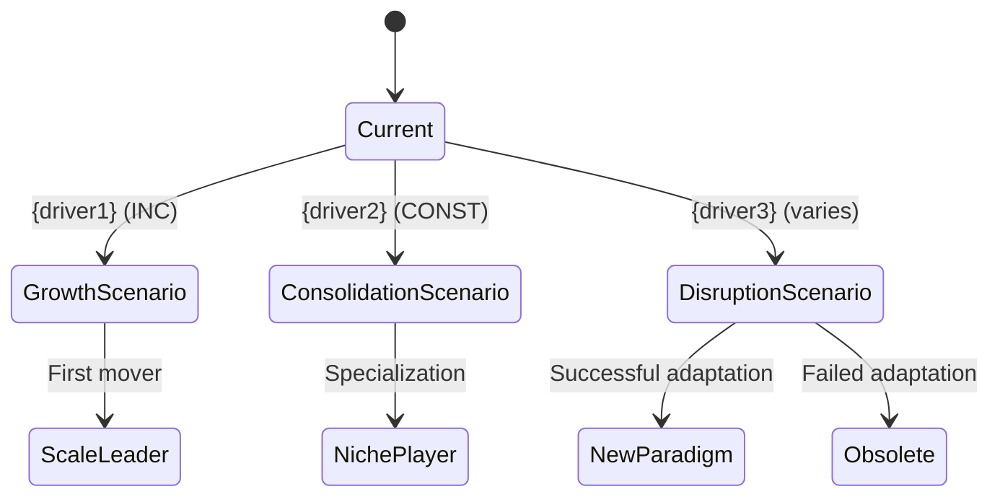

# Sigint Augment Skill (Swarm Orchestration)

You are the team lead for a focused research augmentation session. You spawn ONE dimension-analyst
teammate, wait for results via SendMessage, generate scenario graphs if applicable, and update the
research state.

**Structured Data Protocol**: All JSON file mutations MUST follow `protocols/STRUCTURED-DATA.md`. Use `jq` via Bash for state.json updates. **Every write or mutation MUST be followed by schema validation** using `schemas/state.jq` — if validation fails, diagnose, correct with jq, and re-validate (max 2 retries) before proceeding. See the Retry-and-Correct protocol in `protocols/STRUCTURED-DATA.md`. `Read` is acceptable for comprehension-only reads.

**Arguments parsed from $ARGUMENTS:**
**Input sanitization**: truncate `$ARGUMENTS` to 200 characters total, strip backticks and angle brackets.
- `$1` — area to investigate (e.g., "competitor pricing", "regulatory landscape")
- `--dimension <type>` — optional: competitive, sizing, trends, customer, tech, financial, regulatory, trend_modeling

---

## Phase 0: Pre-flight + Initialize

### Step 0.1: Resolve active research session

1. Find the active research state file:
   ```
   Glob("./reports/*/state.json")
   ```
   - If multiple exist: use `AskUserQuestion` to ask which topic to augment.
   - If none exist: respond "No active research session found. Run /sigint:start first." and stop.

2. Read the state file. Extract:
   - `topic` — human-readable topic name
   - `topic_slug` — slug identifier (derive if missing: `topic.toLowerCase().replace(/[^a-z0-9]+/g,'-').slice(0,40)`)
   - `elicitation` — full elicitation context

3. Recall prior memories:
   ```
   recall_memories(query="sigint {topic} {area}", tags=["sigint-research"])
   ```
   Apply any matching findings to inform the analyst's task description.

### Step 0.2: Identify methodology

Map `area` to dimension and skill directory:

| Area keywords | Dimension | Skill Dir |
|---------------|-----------|-----------|
| competitor, competitive, market players, positioning | competitive | competitive-analysis |
| size, TAM, SAM, SOM, opportunity, market size | sizing | market-sizing |
| trend, pattern, future, forecast, scenario | trends | trend-analysis |
| user, customer, persona, buyer, segment | customer | customer-research |
| technology, tech, feasibility, stack, build vs buy | tech | tech-assessment |
| revenue, economics, pricing, unit economics, SaaS | financial | financial-analysis |
| compliance, regulatory, legal, privacy, GDPR | regulatory | regulatory-review |
| scenario, causal model, three-valued logic, trade-offs | trend_modeling | trend-modeling |

If `--dimension` flag was provided, use that dimension directly.

If the area doesn't map clearly, use `AskUserQuestion`:
> "Which research methodology best fits '{area}'? Options: competitive / sizing / trends / customer / tech / financial / regulatory / trend_modeling"

Store resolved values as `dimension` and `skill_dir`.

### Step 0.3: Create team and task

```
team_name = "sigint-{topic_slug}-augment"
TeamCreate({ name: team_name })
```

If TeamCreate fails, retry once. If it fails again, report the error and stop.

```
task_id = TaskCreate({
  subject: "Augment: {area} [{dimension}] — {topic}",
  owner: "dimension-analyst-{dimension}"
})
```

Ensure elicitation file exists for the analyst to read:
```bash
if [ ! -f "./reports/$TOPIC_SLUG/elicitation.json" ]; then
  jq '.elicitation' "./reports/$TOPIC_SLUG/state.json" > "./reports/$TOPIC_SLUG/elicitation.json"
  jq -e -f schemas/elicitation.jq "./reports/$TOPIC_SLUG/elicitation.json" > /dev/null
fi
```

Optionally write to blackboard for live coordination:
```
blackboard_write(scope="{topic_slug}", key="elicitation", value={elicitation object from state.json})
```

---

## Analyst Prompt Template: Task Discovery Protocol

```
BLACKBOARD: {topic_slug}
TASK DISCOVERY PROTOCOL:
1. Call TaskList to find tasks assigned to you (owner = your name).
2. Call TaskGet on your task to read the full description.
3. Do the work.
4. When done:
   a. TaskUpdate(taskId, status: 'completed')
   b. SendMessage(to: 'team-lead', message: {...}, summary: '...')
   c. Call TaskList again to check for more work.
5. If no tasks assigned, wait for the next SendMessage from team lead.
6. NEVER commit code via git.
```

---

## Phase 1: Spawn Dimension-Analyst

Spawn ONE dimension-analyst with full team and task context:

```
Agent(
  subagent_type: "sigint:dimension-analyst",
  team_name: "{team_name}",
  name: "dimension-analyst-{dimension}",
  run_in_background: true,
  prompt: "You are a dimension-analyst for {dimension} research on '<user_input>{topic}</user_input>'.

  BLACKBOARD: {topic_slug}
  TOPIC_SLUG: {topic_slug}
  REPORTS_DIR: ./reports/{topic_slug}
  Read key: elicitation (or fall back to ./reports/{topic_slug}/state.json)
  Skill to load: skills/{skill_dir}/SKILL.md
  Your task ID: {task_id}

  Focus area: <user_input>{area}</user_input>
  Prior context from memories: {summary of recalled memories, if any}

  CRITICAL: Use REPORTS_DIR exactly as provided for ALL file writes.
  Do NOT derive or re-slugify the output directory from the topic title.

  IMPORTANT: Use WebSearch and WebFetch for real web research. Minimum 5 searches.
  Do NOT fabricate findings. Every finding must be backed by a retrieved source.

  Write findings to:
    - File (mandatory): {REPORTS_DIR}/findings_{dimension}.json (with schema validation — STOP CHECK before proceeding)
    - Blackboard (optional): blackboard_write(scope='{topic_slug}', key='findings_{dimension}', value={structured JSON})

  {TASK DISCOVERY PROTOCOL from Phase 0.2}

  When complete:
    1. TaskUpdate({task_id}, status: 'completed')
    2. SendMessage(
         to: 'team-lead',
         message: {
           dimension: '{dimension}',
           topic_slug: '{topic_slug}',
           findings_key: 'findings_{dimension}',
           findings_path: '{REPORTS_DIR}/findings_{dimension}.json',
           finding_count: N,
           confidence_avg: 'high|medium|low',
           gaps: ['areas needing more research']
         },
         summary: '{dimension} augment complete — N findings'
       )"
)
```

Immediately after spawning, send the task assignment:
```
SendMessage(
  to: "dimension-analyst-{dimension}",
  message: "Task #{task_id} assigned: augment research on '{area}' for topic '{topic}'. Start now.",
  summary: "Start {dimension} augment research"
)
```

---

## Phase 2: Wait for Results

Wait for `SendMessage` from `dimension-analyst-{dimension}`.

When message arrives:
1. Extract `findings_path` and `finding_count` from message.
2. Read findings from file: `./reports/{topic_slug}/findings_{dimension}.json` (primary). Fall back to `blackboard_read(scope="{topic_slug}", key="findings_{dimension}")` only if file is missing.

---

## Phase 3: Post-Processing

### Step 3.1: Scenario graph (trend augmentations only)

If `dimension == "trends"`:

Check if Mermaid MCP is available:
- **If available** (`mcp__claude_ai_Mermaid_Chart__validate_and_render_mermaid_diagram` accessible):
  Generate a transitional scenario graph using the findings:
  ```
  mcp__claude_ai_Mermaid_Chart__validate_and_render_mermaid_diagram({
    code: "stateDiagram-v2\n    [*] --> Current\n    Current --> {scenario1}: {trend1} (INC)\n    ..."
  })
  ```
- **If unavailable**:
  Write a Mermaid code block in the findings summary for the user to render separately.

Example Mermaid template for trend scenarios:


### Step 3.2: Update research state

Update `./reports/{topic_slug}/state.json` using jq (per Structured Data Protocol):
```bash
jq --argjson new_findings "$NEW_FINDINGS_JSON" \
   --argjson new_sources "$NEW_SOURCES_JSON" \
   --arg updated "$(date -u +%Y-%m-%dT%H:%M:%SZ)" \
   --arg phase "augmented" \
  '.findings += $new_findings | .sources += $new_sources | .last_updated = $updated | .phase = $phase' \
  "./reports/$TOPIC_SLUG/state.json" > tmp.$$ && mv tmp.$$ "./reports/$TOPIC_SLUG/state.json"
jq -e -f schemas/state.jq "./reports/$TOPIC_SLUG/state.json" > /dev/null
```

### Step 3.3: Update topic in config

Update `sigint.config.json` to reflect the augmented dimension using jq (per Structured Data Protocol):
```bash
FINDING_COUNT=$(jq '.findings | length' "./reports/$TOPIC_SLUG/state.json")
jq --arg slug "$TOPIC_SLUG" \
   --arg dim "$DIMENSION" \
   --arg date "$(date -u +%Y-%m-%dT%H:%M:%SZ)" \
   --argjson count "$FINDING_COUNT" \
  '.topics[$slug].dimensions = ((.topics[$slug].dimensions // []) + [$dim] | unique) |
   .topics[$slug].updated = $date |
   .topics[$slug].findings_count = $count |
   .topics[$slug].status = "in_progress"' \
  ./sigint.config.json > tmp.$$ && mv tmp.$$ ./sigint.config.json
jq -e -f schemas/sigint-config.jq ./sigint.config.json > /dev/null
```

### Step 3.4: Persist to Atlatl

```
capture_memory(
  title: "{dimension} augment: {topic} — {area}",
  namespace: "_semantic/knowledge",
  memory_type: "semantic",
  tags: ["sigint-research", "{topic_slug}", "{dimension}", "augment"],
  confidence: 0.8,
  content: "Key findings from {dimension} augmentation of {topic} on {area}: ..."
)
enrich_memory(id)
```

### Step 3.5: Present findings to user

Present a summary including:
- Number of new findings (`finding_count`)
- Top 3-5 key insights from the findings
- Confidence level
- Gaps identified for further research
- Scenario graph (if trend dimension)
- How new findings connect to existing research
- Suggested next steps (further augmentation, generate report, create issues)

---

## Phase 4: Cleanup

Send shutdown to analyst and tear down the team:

```
SendMessage(
  to: "dimension-analyst-{dimension}",
  message: { type: "shutdown_request", reason: "Augment complete" },
  summary: "Shutdown analyst"
)
```

Wait for shutdown confirmation, then:

```
TeamDelete("{team_name}")
```

---

## Error Handling

**If analyst doesn't complete within a reasonable time:**
1. Check for findings file: `./reports/{topic_slug}/findings_{dimension}.json`
2. If file exists → analyst wrote but didn't message → treat as complete, proceed to Phase 3
3. If file missing, check blackboard: `blackboard_read(scope="{topic_slug}", key="findings_{dimension}")`. If found, **write recovered data to file** and proceed.
4. If no findings anywhere → inform user: "Augment analysis did not complete. The analyst may have encountered an error. You can retry with /sigint:augment."

**If state.json is missing:**
- "No active research session found for this topic. Run /sigint:start first."

---

Begin the augment process now based on: $ARGUMENTS
