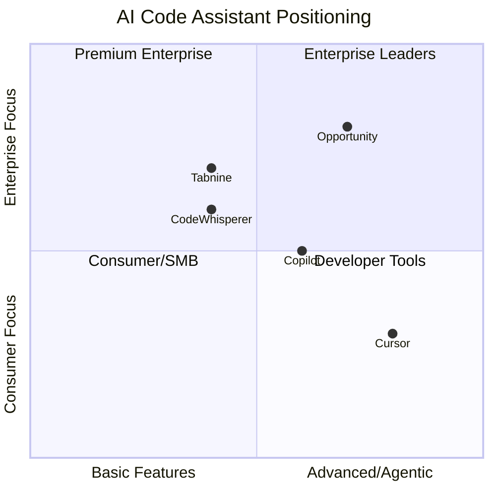

# Competitive Analysis: AI Code Assistant Market

**Date**: 2024-Q4
**Analyst**: Market Research Team
**Status**: Final

---

## Executive Summary

The AI code assistant market is rapidly consolidating around three major players controlling 65% of market share. GitHub Copilot maintains leadership but faces increasing pressure from specialized entrants. Enterprise segment remains underserved, presenting opportunity for compliance-focused positioning.

---

## Competitive Landscape Overview

The AI code assistant market has evolved from experimental tools to mission-critical developer infrastructure. Key dynamics include:

- Rapid feature convergence among top players
- Enterprise adoption accelerating post-2023
- Privacy/security becoming key differentiator
- Open-source alternatives gaining traction

---

## Porter's 5 Forces Analysis

| Force | Rating | Trend | Assessment |
|-------|--------|-------|------------|
| Competitive Rivalry | 4/5 | INC | High - major players competing aggressively |
| Supplier Power | 3/5 | INC | Moderate - LLM providers gaining leverage |
| Buyer Power | 3/5 | CONST | Moderate - switching costs increasing |
| Threat of Substitution | 2/5 | DEC | Low - AI assistance becoming standard |
| Threat of New Entry | 3/5 | INC | Moderate - open-source lowering barriers |

**Overall Industry Attractiveness**: 3.0/5 - Competitive but growing rapidly

---

## Competitor Profiles

### GitHub Copilot (Microsoft)
- **Market Share**: ~40%
- **Positioning**: Full-featured, IDE-integrated
- **Pricing**: $10-19/user/month
- **Strengths**: VS Code integration, training data, brand
- **Weaknesses**: Privacy concerns, enterprise features limited
- **Trend**: INC (expanding enterprise features)

### Cursor
- **Market Share**: ~15%
- **Positioning**: AI-native IDE
- **Pricing**: $20-40/user/month
- **Strengths**: Purpose-built experience, agentic features
- **Weaknesses**: Smaller ecosystem, learning curve
- **Trend**: INC (rapid growth, developer enthusiasm)

### Amazon CodeWhisperer
- **Market Share**: ~10%
- **Positioning**: AWS-integrated, security-focused
- **Pricing**: Free tier, $19/user/month pro
- **Strengths**: AWS integration, security scanning
- **Weaknesses**: Less polished, narrower language support
- **Trend**: CONST (steady but not gaining share)

### Tabnine
- **Market Share**: ~8%
- **Positioning**: Privacy-first, on-premise option
- **Pricing**: $12-39/user/month
- **Strengths**: Self-hosted option, privacy
- **Weaknesses**: Less capable models
- **Trend**: CONST (niche positioning)

---

## Competitive Matrix

| Dimension | Copilot | Cursor | CodeWhisperer | Tabnine |
|-----------|---------|--------|---------------|---------|
| Market Share | 40% | 15% | 10% | 8% |
| Pricing | $$ | $$$ | $-$$ | $$ |
| IDE Support | Broad | Own IDE | AWS/VS Code | Broad |
| Enterprise Features | Medium | Low | Medium | High |
| Privacy/On-Prem | No | No | Partial | Yes |
| Agentic Capabilities | Medium | High | Low | Low |
| Trend | INC | INC | CONST | CONST |

---

## Positioning Map

**Opportunity Zone**: Advanced features + Enterprise focus is underserved.

---

## Key Insights

### 1. Enterprise Gap Exists
While consumer/SMB segment is crowded, enterprise buyers cite unmet needs:
- Compliance and audit trails
- Self-hosted deployment options
- Integration with enterprise systems
- Customization and fine-tuning

### 2. Agentic Features Differentiating
Cursor's rapid growth demonstrates appetite for more autonomous coding assistance. Copilot's agent features in preview suggest this becomes table stakes.

### 3. Privacy Becoming Differentiator
Post-Copilot-lawsuit concerns elevated privacy considerations. Organizations increasingly asking about training data, code exposure, and self-hosting.

---

## Strategic Recommendations

1. **Target Enterprise with Compliance Focus**
   - Differentiator: SOC2, HIPAA, FedRAMP readiness
   - Offering: Self-hosted + cloud options
   - Pricing: Premium ($40-100/user/month)

2. **Invest in Agentic Capabilities**
   - Match Cursor's agentic features
   - Add enterprise-appropriate guardrails
   - Focus on workflow automation, not just completion

3. **Build Partner Ecosystem**
   - IDE integrations beyond VS Code
   - Enterprise tool integrations (Jira, Confluence)
   - Security scanning partnerships

---

## Monitoring Indicators

Track these for competitive shifts:

| Indicator | Source | Frequency |
|-----------|--------|-----------|
| Copilot enterprise deals | News, job postings | Monthly |
| Cursor funding/growth | Crunchbase, press | Quarterly |
| Open-source alternatives | GitHub, Hacker News | Monthly |
| Enterprise RFP requirements | Sales team | Ongoing |

---

## Data Sources

- Public company filings and announcements
- Industry analyst reports (Gartner, Forrester)
- Developer surveys (Stack Overflow, JetBrains)
- Pricing pages and documentation
- Job posting analysis (LinkedIn)
- Customer reviews (G2, Reddit)
