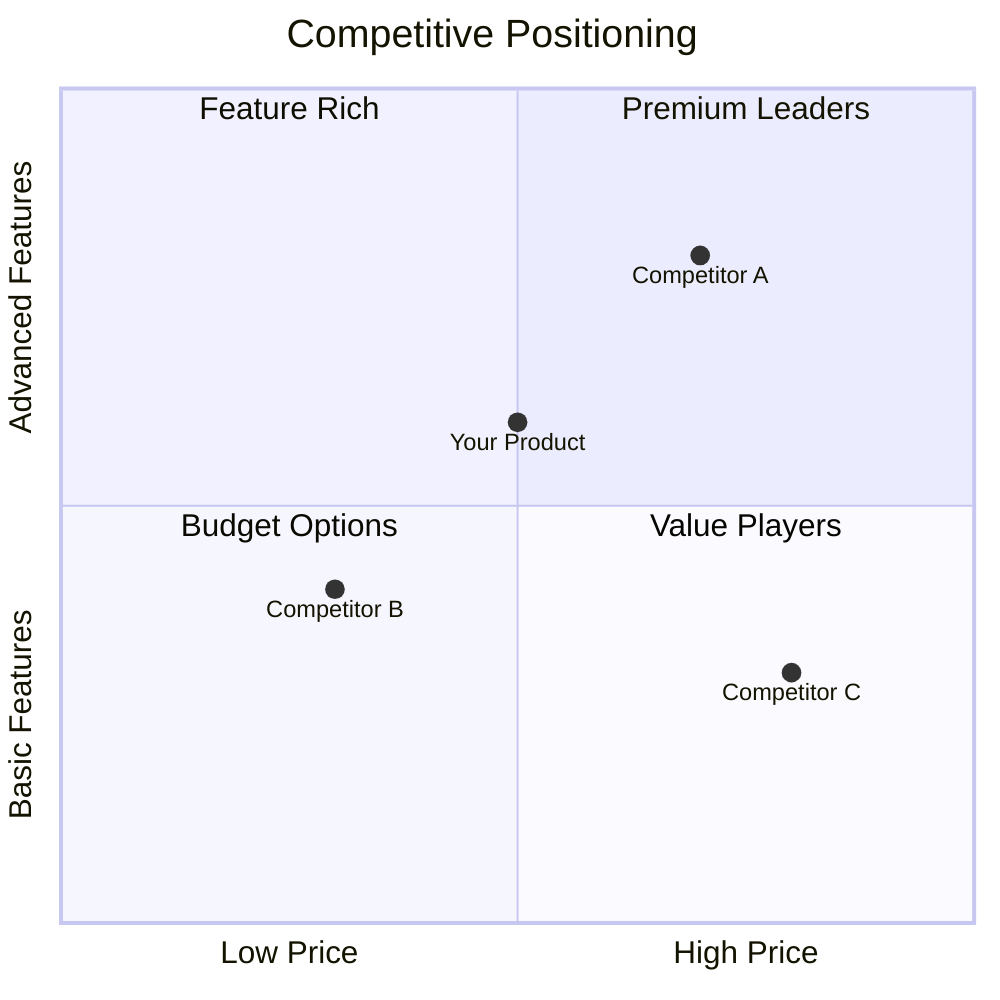

# Competitive Matrix Templates

## Basic Competitor Comparison Matrix

```markdown
| Dimension | Your Product | Competitor A | Competitor B | Competitor C |
|-----------|--------------|--------------|--------------|--------------|
| **Market Position** |
| Market Share | X% | X% | X% | X% |
| Target Segment | | | | |
| Years in Market | | | | |
| **Product** |
| Core Features | | | | |
| Unique Features | | | | |
| Platform Support | | | | |
| **Pricing** |
| Entry Price | $ | $ | $ | $ |
| Enterprise Price | $ | $ | $ | $ |
| Pricing Model | | | | |
| **Strengths** | | | | |
| **Weaknesses** | | | | |
| **Trend** | - | INC/DEC/CONST | INC/DEC/CONST | INC/DEC/CONST |
```

## Feature Comparison Matrix

```markdown
| Feature | Priority | Your Product | Comp A | Comp B | Comp C |
|---------|----------|--------------|--------|--------|--------|
| [Feature 1] | High | Full | Full | Partial | None |
| [Feature 2] | High | Full | None | Full | Partial |
| [Feature 3] | Medium | Partial | Full | Full | Full |
| [Feature 4] | Medium | Full | Partial | None | Full |
| [Feature 5] | Low | None | Full | Partial | None |

**Legend**: Full = Complete implementation | Partial = Limited | None = Not available
```

## Pricing Comparison Matrix

```markdown
| Tier | Your Product | Competitor A | Competitor B | Notes |
|------|--------------|--------------|--------------|-------|
| Free | ✓ / ✗ | ✓ / ✗ | ✓ / ✗ | |
| Starter | $X/mo | $X/mo | $X/mo | |
| Professional | $X/mo | $X/mo | $X/mo | |
| Enterprise | Custom | $X/mo | Custom | |
| **Users Included** | | | | |
| Starter | X | X | X | |
| Professional | X | X | X | |
| **Key Limitations** | | | | |
```

## Strengths/Weaknesses Matrix

```markdown
| Competitor | Key Strengths | Key Weaknesses | Opportunity |
|------------|---------------|----------------|-------------|
| Competitor A | - Strength 1<br>- Strength 2 | - Weakness 1<br>- Weakness 2 | [How to exploit] |
| Competitor B | - Strength 1<br>- Strength 2 | - Weakness 1<br>- Weakness 2 | [How to exploit] |
| Competitor C | - Strength 1<br>- Strength 2 | - Weakness 1<br>- Weakness 2 | [How to exploit] |
```

## Positioning Map Data

```markdown
| Competitor | X-Axis Score | Y-Axis Score | Bubble Size | Notes |
|------------|--------------|--------------|-------------|-------|
| Your Product | X | Y | Revenue/Share | |
| Competitor A | X | Y | Revenue/Share | |
| Competitor B | X | Y | Revenue/Share | |

**Axes Options**:
- Price (Low → High)
- Features (Basic → Advanced)
- Quality (Low → Premium)
- Ease of Use (Complex → Simple)
- Target Market (SMB → Enterprise)
```

## Mermaid Quadrant Chart



## Trend Tracking Matrix

```markdown
| Metric | Competitor | Q1 | Q2 | Q3 | Q4 | Trend |
|--------|------------|----|----|----|----|-------|
| Market Share | A | X% | X% | X% | X% | INC |
| | B | X% | X% | X% | X% | DEC |
| Pricing | A | $X | $X | $X | $X | CONST |
| | B | $X | $X | $X | $X | DEC |
| Features | A | X | X | X | X | INC |
| | B | X | X | X | X | CONST |
```

## Competitive Response Matrix

```markdown
| Your Action | Competitor A Response | Competitor B Response | Risk Level |
|-------------|----------------------|----------------------|------------|
| Price cut | Match / Ignore / Attack | Match / Ignore / Attack | H/M/L |
| New feature | Copy / Different / None | Copy / Different / None | H/M/L |
| New segment | Follow / Defend / Ignore | Follow / Defend / Ignore | H/M/L |
```

## Usage Tips

1. **Be objective**: Rate competitors fairly, including where they're better
2. **Cite sources**: Note where data comes from (public, estimate, customer feedback)
3. **Date stamp**: Competitive landscapes change; note when data was gathered
4. **Prioritize dimensions**: Weight factors by importance to target customers
5. **Update regularly**: Refresh quarterly at minimum
