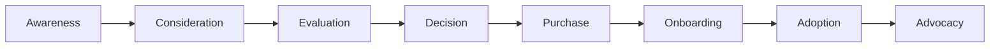

# Customer Journey Map: Enterprise Software Buyer

**Persona**: Alex, VP of Engineering
**Product Category**: Developer Productivity Platform
**Journey Type**: New Purchase

---

## Journey Overview

---

## Stage 1: Awareness

### Trigger Events
- Board pressure to improve engineering velocity
- Competitor announced faster release cycles
- Developer satisfaction survey showed tool frustration
- Industry report highlighted productivity gaps

### Actions
| Action | Channel | Frequency |
|--------|---------|-----------|
| Reads industry reports | Analyst sites, newsletters | Weekly |
| Discusses with peers | Slack communities, conferences | Monthly |
| Searches for solutions | Google, G2 Crowd | Ad-hoc |
| Receives vendor outreach | Email, LinkedIn | Daily |

### Thoughts
> "We're spending too much time on tooling friction. There has to be a better way."

> "I keep hearing about this category - maybe it's time to look."

### Emotions
- 😤 Frustration with current state
- 🤔 Curiosity about solutions
- 😟 Concern about investment required

### Pain Points
- Information overload - too many options
- Hard to distinguish real value from marketing
- No time to research properly

### Opportunities
- **Content marketing**: Educational content addressing pain
- **Social proof**: Peer references and case studies
- **Thought leadership**: Credible industry perspectives

---

## Stage 2: Consideration

### Actions
| Action | Channel | Frequency |
|--------|---------|-----------|
| Creates shortlist | Internal research | Once |
| Requests analyst briefings | Gartner, Forrester | 2-3 times |
| Reviews G2/Capterra | Review sites | Several times |
| Talks to network | LinkedIn, Slack | Ongoing |

### Thoughts
> "Let me narrow this down to 3-5 realistic options."

> "I need to understand how this fits our architecture."

### Emotions
- 🧐 Analytical mode
- 😰 Anxiety about making wrong choice
- 😊 Excitement about potential improvements

### Pain Points
- Difficult to compare apples-to-apples
- Pricing not transparent
- Hard to assess cultural fit

### Opportunities
- **Comparison content**: Honest competitive comparisons
- **Architecture guides**: Integration documentation
- **Transparent pricing**: Or at least pricing philosophy

---

## Stage 3: Evaluation

### Actions
| Action | Channel | Frequency |
|--------|---------|-----------|
| Requests demos | Vendor websites | 3-5 times |
| Runs proof of concept | Internal systems | 2-3 vendors |
| Involves stakeholders | Internal meetings | Weekly |
| Security/compliance review | Questionnaires | Per vendor |

### Thoughts
> "Does this actually work with our systems?"

> "Can I get my team to actually adopt this?"

### Emotions
- 🎯 Focused determination
- 😬 Stress from stakeholder management
- 🤞 Hope that one option stands out

### Pain Points
- POC takes too long
- Hard to simulate real environment
- Internal stakeholders have competing priorities
- Security questionnaires are painful

### Opportunities
- **Streamlined POC**: Quick-start environments
- **Champion enablement**: Tools to help internal advocates
- **Security prep**: Pre-completed questionnaires, certifications

---

## Stage 4: Decision

### Actions
| Action | Channel | Frequency |
|--------|---------|-----------|
| Final stakeholder alignment | Meetings | 2-3 times |
| Reference calls | Phone/video | 2-3 calls |
| Negotiation | Email, calls | Multiple rounds |
| Business case documentation | Internal docs | Once |

### Decision Makers
| Role | Influence | Concerns |
|------|-----------|----------|
| VP Engineering (Alex) | Primary | ROI, adoption, integration |
| CTO | Final approval | Architecture, strategy |
| Security | Veto power | Compliance, data handling |
| Procurement | Negotiation | Pricing, terms |
| CFO | Budget approval | Cost, ROI timeline |

### Thoughts
> "I need to build a compelling case for leadership."

> "What's the real risk if this doesn't work?"

### Emotions
- 😰 High anxiety - career implications
- 🤝 Seeking assurance
- 💪 Determination to close

### Pain Points
- Internal politics and competing priorities
- Difficulty quantifying ROI
- Procurement processes slow everything down

### Opportunities
- **ROI tools**: Calculators, benchmarks
- **Executive content**: C-suite ready materials
- **Procurement support**: Standard terms, quick processes

---

## Stage 5: Purchase

### Actions
| Action | Channel | Frequency |
|--------|---------|-----------|
| Contract negotiation | Legal, email | 2-4 weeks |
| Signature | DocuSign | Once |
| Kickoff scheduling | Email | Once |
| Internal announcement | Slack, email | Once |

### Thoughts
> "Finally, let's get this done."

> "I hope the implementation goes smoothly."

### Emotions
- 😌 Relief that decision is made
- 🤞 Hope for smooth implementation
- 📢 Pride in driving change

### Pain Points
- Contract review takes too long
- Scheduling kickoff is complex
- Handoff from sales to success

### Opportunities
- **Fast contracting**: Pre-approved terms
- **Seamless handoff**: Warm introduction to CS
- **Quick start**: Clear path to first value

---

## Stage 6: Onboarding

### Actions
| Action | Channel | Frequency |
|--------|---------|-----------|
| Kickoff meeting | Video call | Once |
| Technical setup | Product + docs | 1-2 weeks |
| Team training | Workshops | 2-3 sessions |
| Pilot rollout | Internal | 2-4 weeks |

### Success Metrics
- Time to first value < 2 weeks
- Pilot team satisfaction > 4/5
- Technical integration complete

### Thoughts
> "Let's get quick wins to build momentum."

> "I need my champion team to succeed first."

### Emotions
- 🚀 Eager to show results
- 😬 Anxious about adoption
- 👀 Watching closely for issues

### Pain Points
- Learning curve steeper than expected
- Integration challenges
- Competing priorities slow adoption

### Opportunities
- **Fast time-to-value**: Quick wins in week 1
- **Champion support**: Extra attention to pilot team
- **Integration help**: Technical resources, office hours

---

## Stage 7: Adoption

### Actions
| Action | Channel | Frequency |
|--------|---------|-----------|
| Broader rollout | Internal | Phased |
| Measure outcomes | Analytics, surveys | Monthly |
| Address issues | Support, success | As needed |
| Expand usage | Features, seats | Quarterly |

### Thoughts
> "Is this delivering the value we expected?"

> "How do I scale this across the organization?"

### Emotions
- 📊 Analytical - measuring success
- 😊 Satisfaction with progress (hopefully)
- 🤔 Considering what's next

### Pain Points
- Pockets of resistance
- Measuring true ROI
- Keeping momentum

### Opportunities
- **Success measurement**: Automated ROI tracking
- **Expansion playbook**: Proven rollout patterns
- **Community**: Connect with other customers

---

## Stage 8: Advocacy

### Actions
| Action | Channel | Frequency |
|--------|---------|-----------|
| Internal success stories | Company comms | Quarterly |
| External references | Calls, case studies | As requested |
| Peer recommendations | Network | Organic |
| Speaking opportunities | Conferences | Annual |

### Thoughts
> "This was a good decision - I should share what I learned."

> "Happy to help others going through this."

### Emotions
- 😊 Pride in successful initiative
- 🤝 Willingness to help peers
- 🏆 Recognition for driving change

### Opportunities
- **Reference program**: Easy ways to share story
- **Community leadership**: Speaking, advisory
- **Exclusive benefits**: Appreciation for advocacy

---

## Journey Summary

| Stage | Duration | Key Need | Top Opportunity |
|-------|----------|----------|-----------------|
| Awareness | 1-3 months | Education | Thought leadership |
| Consideration | 2-4 weeks | Comparison | Competitive content |
| Evaluation | 4-8 weeks | Proof | Streamlined POC |
| Decision | 2-4 weeks | Confidence | ROI tools, references |
| Purchase | 1-3 weeks | Speed | Fast contracting |
| Onboarding | 2-4 weeks | Quick wins | Time-to-value focus |
| Adoption | 3-6 months | Momentum | Success measurement |
| Advocacy | Ongoing | Recognition | Community, reference programs |

---

## Trend Indicators

| Journey Metric | Direction | Evidence |
|----------------|-----------|----------|
| Research time | DEC | More self-service info available |
| Stakeholders involved | INC | Security, privacy roles growing |
| POC expectations | INC | Want faster, more realistic trials |
| Post-purchase support needs | INC | Higher expectations for success |
