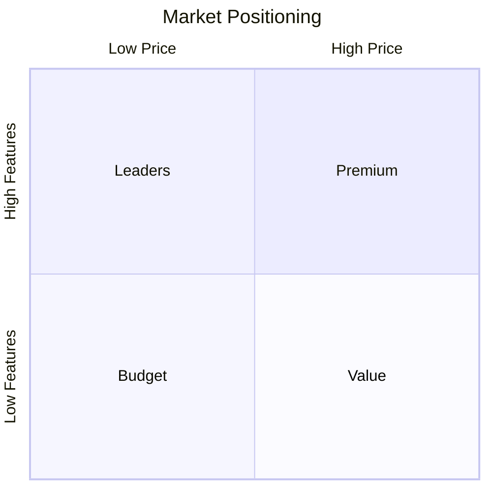
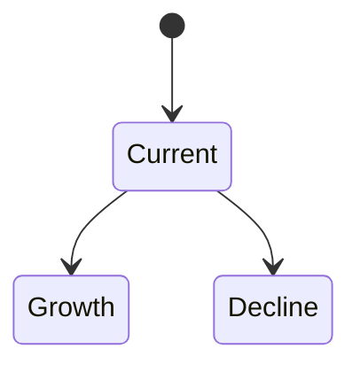
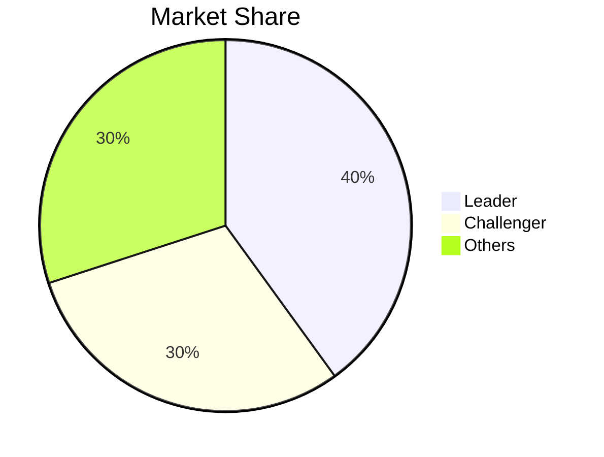

# Report Writing

## Overview

Report writing transforms research findings into clear, actionable documents for decision-makers. This skill covers best practices for structuring, writing, and visualizing market research outputs.

## Report Types

### Executive Brief (1-2 pages)
- Key findings only
- Single recommendation
- For: C-suite, board
- Time to read: 5 minutes

### Research Summary (3-5 pages)
- Main findings with evidence
- Multiple recommendations
- For: VPs, directors
- Time to read: 15 minutes

### Full Report (10-30 pages)
- Comprehensive analysis
- Detailed methodology
- For: Analysts, implementers
- Time to read: 30-60 minutes

### Appendix/Data Pack
- Supporting data
- Detailed tables
- For: Deep dives
- Reference as needed

## Document Structure

### Executive Summary (Always First)

**Length**: 1 paragraph to 1 page
**Content**:
1. Context (1 sentence)
2. Key findings (3-5 bullets)
3. Primary recommendation
4. Critical risk or caveat

**Example**:
> We analyzed the AI code assistant market to evaluate entry opportunity. Key findings: (1) Market growing 45% annually to $15B by 2027; (2) Top 3 players hold 60% share with consolidation expected; (3) Enterprise segment underserved; (4) Regulatory uncertainty emerging. **Recommendation**: Pursue enterprise segment with compliance-focused positioning. **Risk**: AI regulation may increase development costs 20-40%.

### Body Sections

**Market Overview**
- What: Define the market
- Why: Why this matters now
- How big: Size and growth

**Analysis Sections**
- Follow logical flow
- Lead with insights, support with data
- Use headers for scannability
- Include trend indicators (INC/DEC/CONST)

**Recommendations**
- Numbered, prioritized
- Each has: What, Why, How, Risk
- Actionable and specific

**Appendix**
- Methodology notes
- Data sources
- Detailed tables
- Additional analysis

## Writing Principles

### Clarity First

**Do**: Lead with the insight
> Market consolidation is accelerating, with top 3 players' share growing from 45% to 60% in 18 months.

**Don't**: Bury the insight
> According to our research, when we looked at market share data over the past 18 months, we found that the leading companies have been growing.

### Pyramid Structure

1. Start with conclusion
2. Support with key points
3. Provide details as needed

Each paragraph:
- Topic sentence (the point)
- Supporting evidence
- Implication/so what

### Active Voice

**Do**: "Competitors reduced prices 20%"
**Don't**: "Prices were reduced by competitors by 20%"

### Quantify Claims

**Do**: "Revenue grew 45% YoY to $2.3B"
**Don't**: "Revenue grew significantly"

### Hedge Appropriately

- "Data suggests..." (uncertain)
- "Evidence indicates..." (moderate confidence)
- "Analysis confirms..." (high confidence)

## Visualization Guidelines

### When to Use Charts

| Data Type | Best Visualization |
|-----------|-------------------|
| Comparison | Bar chart |
| Trend over time | Line chart |
| Composition | Pie chart (≤6 slices) |
| Relationship | Scatter plot |
| Distribution | Histogram |
| Process/Flow | Flowchart |
| Positioning | Quadrant/matrix |
| Scenarios | State diagram |

### Mermaid Diagram Types

**Quadrant Chart** - Positioning

**State Diagram** - Scenarios

**Pie Chart** - Share

### Table Best Practices

- Left-align text, right-align numbers
- Include units in headers
- Use consistent decimal places
- Highlight key rows/values
- Keep to essential columns

## Audience Tailoring

### For Executives
- Bottom-line first
- Minimal jargon
- Focus on decisions
- Include recommendations
- 1-page max per topic

### For Technical Audiences
- Include methodology
- Show data sources
- Explain assumptions
- Provide detail levels

### For Investors
- Lead with opportunity size
- Highlight competitive advantage
- Address risks prominently
- Include financial metrics

### For Product Teams
- Focus on customer insights
- Include competitive features
- Provide prioritization guidance
- Connect to roadmap

## Quality Checklist

Before finalizing:

### Content
- [ ] Executive summary captures all key points
- [ ] Claims supported by evidence
- [ ] Sources cited appropriately
- [ ] Recommendations are actionable
- [ ] Risks addressed

### Structure
- [ ] Logical flow
- [ ] Consistent heading hierarchy
- [ ] Appropriate section lengths
- [ ] Appendix for detail overflow

### Clarity
- [ ] Active voice used
- [ ] Jargon minimized or explained
- [ ] Numbers formatted consistently
- [ ] Visuals have titles and labels

### Formatting
- [ ] Consistent styling
- [ ] Tables render correctly
- [ ] Diagrams are clear
- [ ] Page breaks sensible

## Output Formats

### Markdown
- Universal compatibility
- Version control friendly
- Easy to convert
- Mermaid diagrams embedded

### HTML
- Styled presentation
- Print-ready
- Interactive potential
- Rendered diagrams

### PDF
- Final distribution
- Locked formatting
- Professional appearance

## Common Mistakes

- Starting with methodology (put in appendix)
- Too much hedge language (undermines confidence)
- Orphan findings (every finding needs "so what")
- Wall of text (use bullets, tables, visuals)
- Missing recommendations (analysis without action)

## Additional Resources

For detailed templates, see:
- `templates/report-template.md` - Full report template with variables
- `templates/executive-brief.md` - Executive brief template
- `references/report-templates.md` - Format templates
- `references/visualization-guide.md` - Chart selection
- `examples/executive-brief.md` - Sample brief
- `examples/full-report.md` - Sample full report
