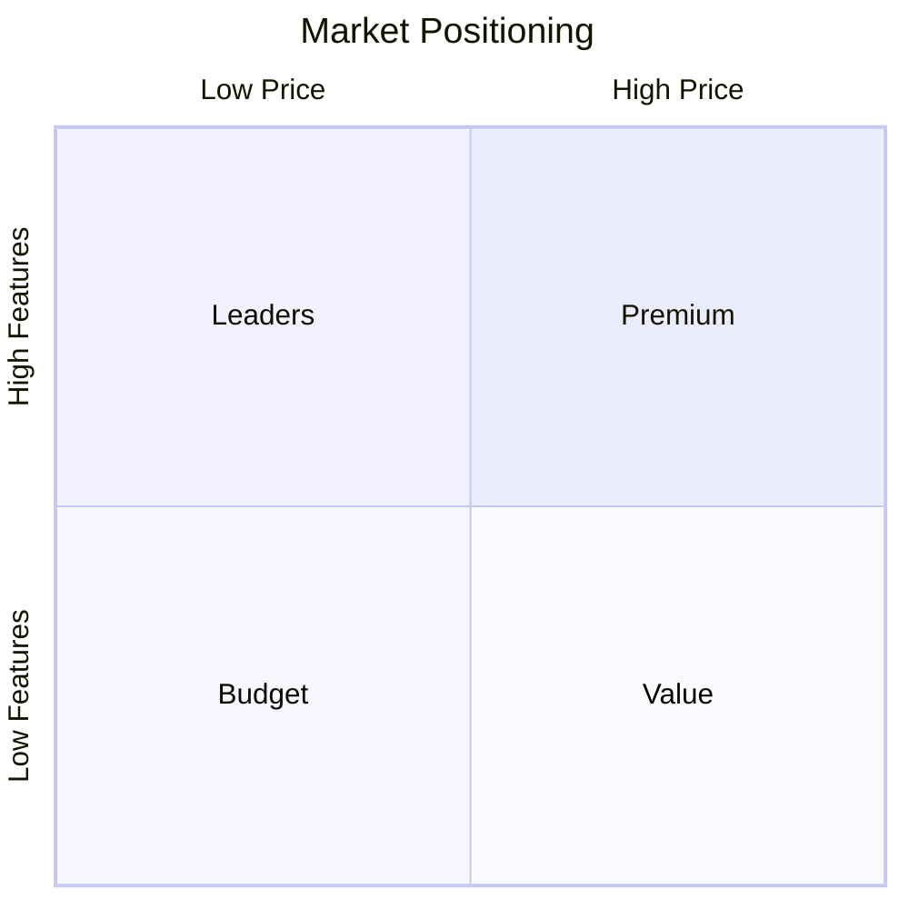
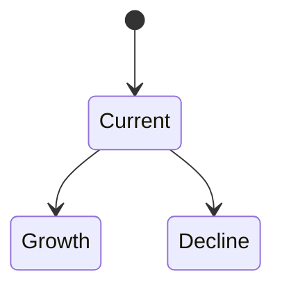
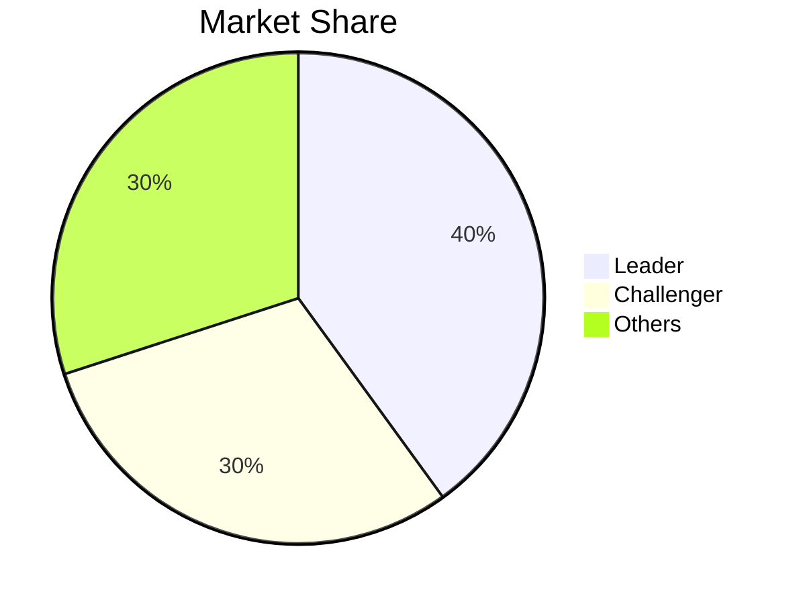

# Report Writing

## Overview

Report writing transforms research findings into clear, actionable documents for decision-makers. This skill covers best practices for structuring, writing, and visualizing market research outputs.

## Critical Rules

1. **ALWAYS start with the Executive Summary** — no report should open with methodology, background, or definitions. The first substantive section must state the bottom-line findings and recommendation.
2. **NEVER fabricate data** — if a number is not provided, say so explicitly. Present ranges when sources disagree. Use hedging language ("data suggests", "estimated") for uncertain claims.
3. **EVERY finding must have a "so what"** — orphan facts that don't connect to implications or recommendations waste the reader's time.
4. **ALWAYS use active voice** — passive voice obscures who did what. Write "Stripe captured 40% share" not "40% share was captured by Stripe".
5. **ALWAYS include at least one Mermaid diagram** — visualization is not optional. Use pie charts for composition, quadrant charts for positioning, state diagrams for scenarios.
6. **Recommendations MUST include What/Why/How/Risk** — vague recommendations ("consider expanding") are useless. Be specific and actionable.
7. **Preserve exact data from the user** — do not round, reinterpret, or omit numbers the user provides. Every data point given must appear in the output.
8. **Match report type to audience** — executive briefs for C-suite (1-2 pages), research summaries for VPs (3-5 pages), full reports for analysts (10-30 pages).

## Report Type Selection

When the user does not specify a report type, use this decision table:

| Signal in User Prompt | Default Report Type |
|----------------------|-------------------|
| "executive brief", "for the CEO", "quick summary" | Executive Brief |
| "research summary", "3-5 pages", "for VPs" | Research Summary |
| "full report", "comprehensive", "detailed", "include everything" | Full Report |
| "data pack", "supporting data", "appendix only" | Appendix/Data Pack |
| No clear signal | Research Summary (safest default) |

## Report Types

### Executive Brief (1-2 pages)
- Key findings only
- Single recommendation
- For: C-suite, board
- Time to read: 5 minutes

### Research Summary (3-5 pages)
- Main findings with evidence
- Multiple recommendations
- For: VPs, directors
- Time to read: 15 minutes

### Full Report (10-30 pages)
- Comprehensive analysis
- Detailed methodology
- For: Analysts, implementers
- Time to read: 30-60 minutes
- MUST include: Table of Contents, at least 6 major sections, `quadrantChart` for competitive positioning, `stateDiagram` for scenario analysis, Appendix with methodology and data sources

### Appendix/Data Pack
- Supporting data
- Detailed tables
- For: Deep dives
- Reference as needed

## Document Structure

### Executive Summary (Always First)

The Executive Summary is the most important section of any report. It must stand alone as a decision document — a reader who reads only the Executive Summary should know the key findings, the recommendation, and the primary risk.

**Length**: 1 paragraph to 1 page
**Content** (in this order):
1. Context (1 sentence — what was analyzed and why)
2. Key findings (3-5 bullets — the essential facts)
3. Primary recommendation (bold, specific, actionable)
4. Critical risk or caveat (the main thing that could go wrong)

**Rules**:
- NEVER open the Executive Summary with methodology ("We conducted..."). Open with the context or the most important finding.
- The recommendation must be specific enough to act on without reading the rest of the report
- Include at least one quantified data point in the Executive Summary

**Example**:
> We analyzed the AI code assistant market to evaluate entry opportunity. Key findings: (1) Market growing 45% annually to $15B by 2027; (2) Top 3 players hold 60% share with consolidation expected; (3) Enterprise segment underserved; (4) Regulatory uncertainty emerging. **Recommendation**: Pursue enterprise segment with compliance-focused positioning. **Risk**: AI regulation may increase development costs 20-40%.

### Body Sections

**Market Overview**
- What: Define the market
- Why: Why this matters now
- How big: Size and growth

**Analysis Sections**
- Follow logical flow
- Lead with insights, support with data
- Use headers for scannability
- Include trend indicators (INC/DEC/CONST)

**Recommendations**
- Numbered, prioritized
- Each MUST have four subsections: **What** (the specific action), **Why** (the business justification with data), **How** (concrete implementation steps), **Risk** (what could go wrong and mitigation)
- Actionable and specific — "Build integrations with AWS, Azure, GCP" not "Consider expanding partnerships"

**Appendix**
- Methodology notes
- Data sources
- Detailed tables
- Additional analysis

## Writing Principles

### Clarity First

**Do**: Lead with the insight
> Market consolidation is accelerating, with top 3 players' share growing from 45% to 60% in 18 months.

**Don't**: Bury the insight
> According to our research, when we looked at market share data over the past 18 months, we found that the leading companies have been growing.

### Pyramid Structure (Minto Pyramid)

Apply the pyramid principle at three levels:

**Document level**: Start with the conclusion (Executive Summary), then supporting sections, then detail.

**Section level**: Each section opens with its key takeaway, followed by supporting data, followed by nuances.

**Paragraph level**:
- Topic sentence (the point — what the reader should remember)
- Supporting evidence (data, quotes, analysis)
- Implication/so what (why this matters for the reader's decision)

**Anti-pattern**: Never open a section with background or process description. "We analyzed 15 tools over 3 months" belongs in the appendix, not at the top of a findings section.

### Active Voice

**Do**: "Competitors reduced prices 20%"
**Don't**: "Prices were reduced by competitors by 20%"

### Quantify Claims

**Do**: "Revenue grew 45% YoY to $2.3B"
**Don't**: "Revenue grew significantly"

### Hedge Appropriately

- "Data suggests..." (uncertain)
- "Evidence indicates..." (moderate confidence)
- "Analysis confirms..." (high confidence)

### Handling Incomplete Data

When the user provides sparse or uncertain data:
- **Present ranges, not point estimates**: If the source says "$1B to $5B", write "$1B to $5B" — do not pick a midpoint
- **Explicitly flag data gaps**: Add a "Data Gaps" or "Limitations" section listing what is unknown
- **Never invent market share or growth figures**: If share data is not available, state "market share data is not publicly available"
- **Still follow report structure**: Missing data does not excuse missing sections — adapt the section to acknowledge the gap
- **Calibrate hedging to confidence level**: More hedging for uncertain claims, less for well-sourced claims

## Visualization Guidelines

### When to Use Charts

| Data Type | Best Visualization |
|-----------|-------------------|
| Comparison | Bar chart |
| Trend over time | Line chart |
| Composition | Pie chart (≤6 slices) |
| Relationship | Scatter plot |
| Distribution | Histogram |
| Process/Flow | Flowchart |
| Positioning | Quadrant/matrix |
| Scenarios | State diagram |

### Visualization Selection Rules

When selecting a visualization, follow these rules strictly:
- **Market share / composition data** → Use a `pie` chart. If there are more than 6 slices, group the smallest into "Others".
- **Competitive positioning on two axes** → Use a `quadrantChart`. Label both axes with descriptive endpoints (e.g., "Low Price --> High Price").
- **Scenarios / state transitions / decision paths** → Use a `stateDiagram-v2`. Show the starting state and possible outcomes.
- **Trend data over time** → Use a table with year/value/growth columns. Mermaid does not support line charts natively — always explain this limitation.
- **Full reports** MUST include at least one `quadrantChart` AND one `stateDiagram` to cover positioning and scenario analysis.
- **Executive briefs** MUST include at least one diagram (typically `pie` for market share).

### Mermaid Diagram Types

**Quadrant Chart** - Positioning

```mermaid
quadrantChart
    title Market Positioning
    x-axis Low Price --> High Price
    y-axis Low Features --> High Features
    quadrant-1 Premium
    quadrant-2 Leaders
    quadrant-3 Budget
    quadrant-4 Value
```

**State Diagram** - Scenarios

```mermaid
stateDiagram-v2
    [*] --> Current
    Current --> Growth
    Current --> Decline
```

**Pie Chart** - Share

```mermaid
pie title Market Share
    "Leader" : 40
    "Challenger" : 30
    "Others" : 30
```

### Table Best Practices

- Left-align text, right-align numbers
- Include units in headers
- Use consistent decimal places
- Highlight key rows/values
- Keep to essential columns

## Audience Tailoring

### For Executives
- Bottom-line first
- Minimal jargon
- Focus on decisions
- Include recommendations
- 1-page max per topic

### For Technical Audiences
- Include methodology in the body (not just appendix) — explain how tests were conducted, what was measured, and what was controlled
- Show data sources with enough detail for reproducibility
- Explain assumptions explicitly — what was held constant, what was varied
- Use technical jargon appropriate to the audience without over-explaining basics
- Include comparison tables with quantitative metrics — technical audiences expect numbers, not adjectives

### For Investors
- Lead with opportunity size (TAM/SAM numbers in the first paragraph)
- Highlight competitive advantage prominently — dedicate a section to the moat
- Address risks in a dedicated section with probability and impact assessments
- Include financial metrics: growth rates, market share, revenue figures
- Frame everything around the investment thesis: why this market, why this company, why now

### For Product Teams
- Focus on customer insights
- Include competitive features
- Provide prioritization guidance
- Connect to roadmap

## Quality Checklist

Before finalizing:

### Content
- [ ] Executive summary captures all key points
- [ ] Claims supported by evidence
- [ ] Sources cited appropriately
- [ ] Recommendations are actionable
- [ ] Risks addressed

### Structure
- [ ] Logical flow
- [ ] Consistent heading hierarchy
- [ ] Appropriate section lengths
- [ ] Appendix for detail overflow

### Clarity
- [ ] Active voice used
- [ ] Jargon minimized or explained
- [ ] Numbers formatted consistently
- [ ] Visuals have titles and labels

### Formatting
- [ ] Consistent styling
- [ ] Tables render correctly
- [ ] Diagrams are clear
- [ ] Page breaks sensible

## Output Format Requirements

**Default output is Markdown** unless the user specifically requests HTML or PDF.

### Markdown (Default)
- Use `## ` for major sections, `### ` for subsections — maintain consistent heading hierarchy
- All Mermaid diagrams wrapped in triple-backtick mermaid code blocks
- Tables use standard Markdown pipe syntax with header separator
- **NEVER use template variables** like `{{company_name}}` or `[INSERT HERE]` in output — fill with actual data or state "data not available"
- Numbers always include units ($, %, B, M) and context (YoY, CAGR, as of date)

### HTML
- Styled presentation
- Print-ready
- Interactive potential
- Rendered diagrams

### PDF
- Final distribution
- Locked formatting
- Professional appearance

## Common Mistakes

1. **Starting with methodology** — methodology belongs in the appendix (or body for technical audiences). Never open a report with "We conducted a study..."
2. **Too much hedge language** — overuse of "might", "could", "potentially" undermines confidence. Use hedging calibrated to data quality, not as a default
3. **Orphan findings** — every finding needs a "so what". If you state "Market grew 25%", immediately follow with the implication
4. **Wall of text** — break up prose with bullets, tables, and diagrams. No paragraph should exceed 4-5 sentences
5. **Missing recommendations** — analysis without actionable next steps is incomplete. Every report needs a Recommendations section
6. **Using passive voice** — "prices were reduced" is weaker than "competitors reduced prices". Active voice creates clarity
7. **Fabricating data** — never invent numbers. If market share data is unavailable, say so rather than estimating without basis
8. **Template variables in output** — never output `{{placeholder}}` or `[TBD]`. Fill with real data or explicitly state the gap

## Additional Resources

For detailed templates, see:
- `templates/report-template.md` - Full report template with variables
- `templates/executive-brief.md` - Executive brief template
- `references/report-templates.md` - Format templates
- `references/visualization-guide.md` - Chart selection
- `examples/executive-brief.md` - Sample brief
- `examples/full-report.md` - Sample full report

## Orchestration Hints

- **Blackboard key**: N/A (report-writing is a synthesis skill, not a research dimension)
- **Cross-reference dimensions**: N/A — consumes all dimensions' findings
- **Alert triggers**: N/A
- **Confidence rules**: Report confidence inherits from source findings; flag any section relying on low-confidence data
- **Conflict detection**: N/A — report-writing surfaces conflicts found by other dimensions rather than detecting new ones
