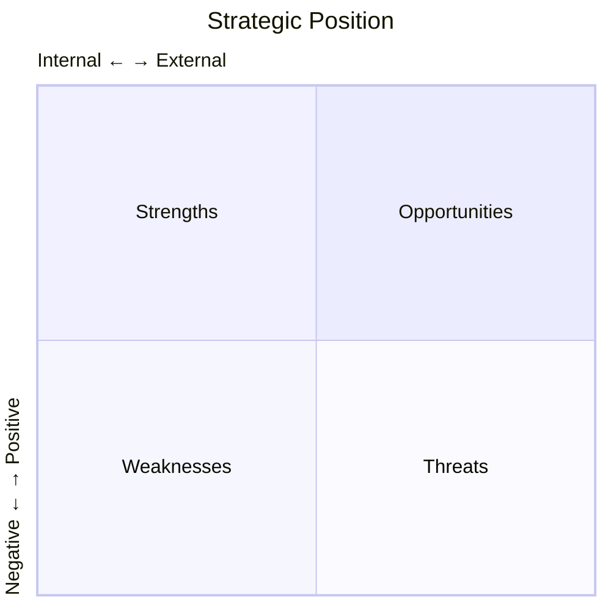

# Report Templates

## Executive Brief Template (1-2 pages)

```markdown
# [Topic] Executive Brief

**Date**: YYYY-MM-DD
**Prepared for**: [Audience]
**Classification**: [Internal/Confidential]

---

## Bottom Line

[2-3 sentences with the key takeaway and recommendation]

---

## Key Findings

1. **[Finding 1 headline]**: [Supporting detail in one sentence]

2. **[Finding 2 headline]**: [Supporting detail in one sentence]

3. **[Finding 3 headline]**: [Supporting detail in one sentence]

---

## Recommendation

**[Primary recommendation]**

- [Supporting point 1]
- [Supporting point 2]
- [Estimated impact]

---

## Critical Risk

[One paragraph on the main risk or caveat to consider]

---

## Next Steps

1. [Immediate action]
2. [Follow-up action]
3. [Decision needed]

---

*Contact: [Name] | [Email]*
```

---

## Research Summary Template (3-5 pages)

```markdown
# [Topic] Research Summary

**Date**: YYYY-MM-DD
**Version**: X.X
**Status**: Draft/Final

---

## Executive Summary

[3-4 sentences summarizing key findings and recommendation]

---

## Context

### Background
[Why this research was conducted]

### Scope
[What was included/excluded]

### Methodology
[Brief description of approach]

---

## Market Overview

### Size & Growth
| Metric | Value | Trend |
|--------|-------|-------|
| TAM | $X | INC/DEC/CONST |
| SAM | $X | INC/DEC/CONST |
| Growth Rate | X% | INC/DEC/CONST |

### Key Dynamics
- [Dynamic 1]
- [Dynamic 2]
- [Dynamic 3]

---

## Competitive Landscape

### Market Leaders
| Player | Share | Strength | Weakness | Trend |
|--------|-------|----------|----------|-------|
| [Name] | X% | [Strength] | [Weakness] | INC/DEC/CONST |

### Positioning Map
[Mermaid quadrant chart]

---

## Key Findings

### Finding 1: [Headline]
[2-3 paragraphs with supporting evidence]

### Finding 2: [Headline]
[2-3 paragraphs with supporting evidence]

### Finding 3: [Headline]
[2-3 paragraphs with supporting evidence]

---

## SWOT Analysis

| Strengths | Weaknesses |
|-----------|------------|
| • [S1] | • [W1] |
| • [S2] | • [W2] |

| Opportunities | Threats |
|---------------|---------|
| • [O1] | • [T1] |
| • [O2] | • [T2] |

---

## Recommendations

### Priority 1: [Recommendation]
- **Rationale**: [Why]
- **Actions**: [How]
- **Risk**: [What could go wrong]

### Priority 2: [Recommendation]
- **Rationale**: [Why]
- **Actions**: [How]
- **Risk**: [What could go wrong]

---

## Appendix

### Data Sources
- [Source 1]: [What it provided]
- [Source 2]: [What it provided]

### Methodology Notes
[Additional detail on approach]
```

---

## Full Report Template (10-30 pages)

```markdown
# [Topic] Market Research Report

**Date**: YYYY-MM-DD
**Version**: X.X
**Authors**: [Names]
**Classification**: [Internal/Confidential]

---

## Table of Contents

1. Executive Summary
2. Introduction
3. Methodology
4. Market Overview
5. Competitive Analysis
6. Customer Insights
7. Technology Assessment
8. Financial Analysis
9. Regulatory Environment
10. SWOT Analysis
11. Scenarios
12. Recommendations
13. Appendices

---

## 1. Executive Summary

### Key Findings
[Bullet list of 5-7 findings]

### Recommendation
[Primary recommendation with supporting points]

### Critical Risks
[Top 2-3 risks]

---

## 2. Introduction

### Background
[Context for the research]

### Objectives
1. [Objective 1]
2. [Objective 2]
3. [Objective 3]

### Scope
**Included**: [What was covered]
**Excluded**: [What was not covered]

### Audience
[Who should read this report]

---

## 3. Methodology

### Research Approach
[Description of methods used]

### Data Sources
| Source | Type | Usage |
|--------|------|-------|
| [Source] | Primary/Secondary | [What it provided] |

### Limitations
[Known limitations and caveats]

### Definitions
| Term | Definition |
|------|------------|
| [Term] | [Definition] |

---

## 4. Market Overview

### Market Definition
[Clear definition of the market]

### Market Size
| Metric | Current | 3-Year | 5-Year | CAGR |
|--------|---------|--------|--------|------|
| TAM | $X | $X | $X | X% |
| SAM | $X | $X | $X | X% |
| SOM | $X | $X | $X | X% |

### Growth Drivers
[Analysis of what's driving growth]

### Market Segments
[Breakdown by segment]

### Regional Analysis
[Geographic breakdown]

---

## 5. Competitive Analysis

### Industry Structure (Porter's 5 Forces)
[Force-by-force analysis]

### Competitor Profiles
[Detailed profiles of key competitors]

### Competitive Matrix
[Feature/capability comparison]

### Positioning Map
[Visual positioning]

---

## 6. Customer Insights

### Customer Segments
[Segment descriptions]

### Key Personas
[Persona summaries]

### Needs and Pain Points
[Ranked list]

### Buying Behavior
[Journey and decision factors]

---

## 7. Technology Assessment

### Technology Landscape
[Current state of technology]

### Emerging Technologies
[What's coming]

### Build vs. Buy Analysis
[If applicable]

---

## 8. Financial Analysis

### Market Economics
[Revenue models, pricing]

### Unit Economics
[Key metrics]

### Investment Activity
[Funding trends]

---

## 9. Regulatory Environment

### Current Regulations
[Applicable frameworks]

### Regulatory Trends
[What's changing]

### Compliance Requirements
[What's required]

---

## 10. SWOT Analysis

[Comprehensive SWOT]

---

## 11. Scenarios

### Scenario Development
[How scenarios were developed]

### Scenario Descriptions
[3-4 scenarios with detail]

### Transitional Graph
[Mermaid state diagram]

### Implications
[What each scenario means]

---

## 12. Recommendations

### Strategic Recommendations
[Prioritized list with rationale]

### Tactical Recommendations
[Near-term actions]

### Monitoring Plan
[What to watch going forward]

---

## 13. Appendices

### A. Detailed Data Tables
### B. Interview Summaries
### C. Source Bibliography
### D. Glossary
```

---

## Section Templates

### SWOT Section

```markdown
## SWOT Analysis



### Strengths
| Strength | Evidence | Strategic Value |
|----------|----------|-----------------|
| [S1] | [Data] | High/Medium/Low |

### Weaknesses
| Weakness | Evidence | Risk Level |
|----------|----------|------------|
| [W1] | [Data] | High/Medium/Low |

### Opportunities
| Opportunity | Trend | Fit |
|-------------|-------|-----|
| [O1] | INC/DEC/CONST | High/Medium/Low |

### Threats
| Threat | Trend | Severity |
|--------|-------|----------|
| [T1] | INC/DEC/CONST | High/Medium/Low |
```

### Recommendation Section

```markdown
## Recommendation: [Title]

### Summary
[One sentence recommendation]

### Rationale
[Why this is recommended]

### Actions Required
1. [Action 1]
2. [Action 2]
3. [Action 3]

### Expected Outcomes
- [Outcome 1]
- [Outcome 2]

### Risks & Mitigations
| Risk | Likelihood | Mitigation |
|------|------------|------------|
| [Risk] | H/M/L | [Action] |

### Success Metrics
- [Metric 1]: [Target]
- [Metric 2]: [Target]

### Timeline
[High-level timeline]
```
