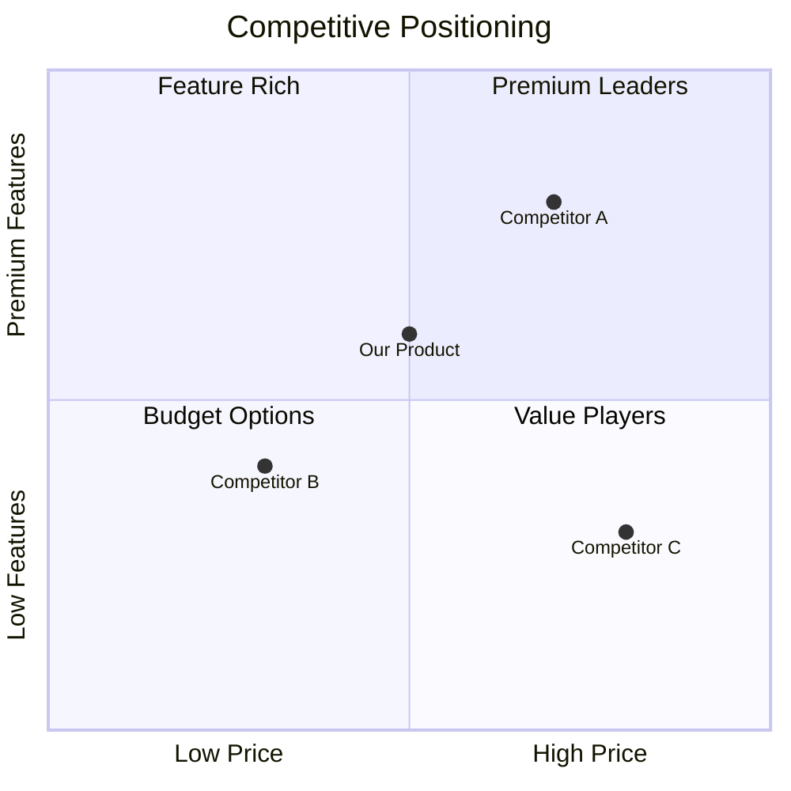
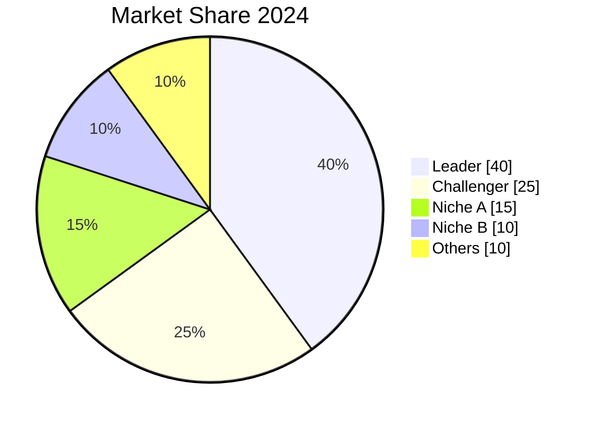
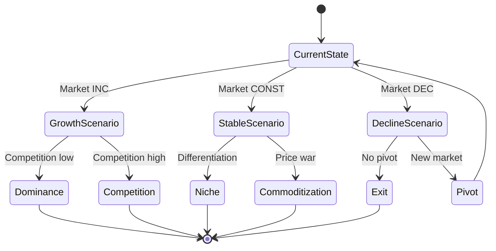
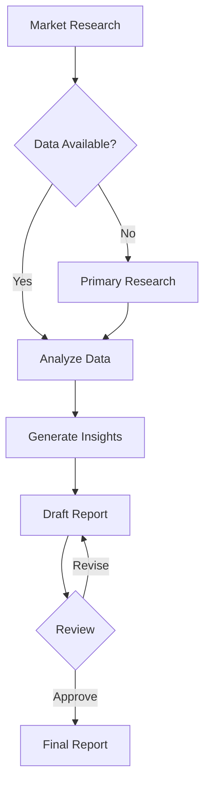
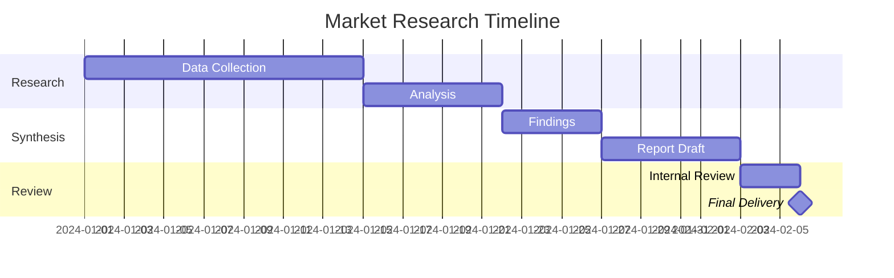

# Visualization Selection Guide

## Chart Selection Matrix

| Data Type | Best Chart | Alternative | Avoid |
|-----------|------------|-------------|-------|
| Comparison | Bar chart | Table | Pie chart (if >6 items) |
| Trend over time | Line chart | Area chart | Bar chart |
| Part-to-whole | Pie chart (≤6) | Stacked bar | Line chart |
| Distribution | Histogram | Box plot | Pie chart |
| Relationship | Scatter plot | Bubble chart | Line chart |
| Hierarchy | Tree map | Sunburst | Bar chart |
| Flow/Process | Sankey, Flowchart | Swimlane | Static diagrams |
| Geographic | Map | Table by region | Bar chart |
| Positioning | Quadrant chart | Scatter plot | Pie chart |
| Scenarios | State diagram | Decision tree | Static list |

---

## Mermaid Diagram Examples

### Quadrant Chart (Positioning)



**Use For**:
- Competitive positioning
- Product comparison
- Strategic mapping
- 2x2 frameworks

### Pie Chart (Market Share)



**Use For**:
- Market share
- Revenue mix
- Segment breakdown
- Part-to-whole (≤6 slices)

**Avoid When**:
- More than 6 categories
- Comparing across time
- Values are close together

### State Diagram (Scenarios)



**Use For**:
- Scenario transitions
- Decision trees
- Process flows
- State changes

### Flowchart (Process)



**Use For**:
- Research process
- Decision logic
- Workflow documentation
- System architecture

### Timeline/Gantt (Roadmap)



**Use For**:
- Project timelines
- Research roadmaps
- Implementation plans

---

## Table Best Practices

### Formatting Rules

1. **Alignment**:
   - Text: Left-align
   - Numbers: Right-align
   - Headers: Match content alignment

2. **Number Formatting**:
   - Use consistent decimal places
   - Include currency symbols
   - Use thousands separators for large numbers

3. **Highlighting**:
   - Bold key values
   - Use color sparingly
   - Consider emoji indicators (🟢🟡🔴)

### Comparison Table

```markdown
| Metric | Competitor A | Competitor B | Our Product | Benchmark |
|--------|-------------:|-------------:|------------:|----------:|
| Price | $99/mo | $149/mo | $79/mo | $100/mo |
| Users | 10K | 50K | 5K | - |
| NPS | 42 | 68 | 55 | 50 |
| Growth | 15% | 25% | 45% | 20% |
```

### Trend Indicator Table

```markdown
| Variable | Current | Previous | Change | Trend |
|----------|--------:|--------:|-------:|:-----:|
| Revenue | $2.5M | $2.1M | +19% | INC |
| Customers | 450 | 425 | +6% | INC |
| Churn | 3.2% | 3.5% | -9% | INC |
| NPS | 52 | 51 | +2% | CONST |
```

### SWOT Table

```markdown
| Strengths | Weaknesses |
|-----------|------------|
| • Strong brand | • Limited distribution |
| • Loyal customers | • High costs |
| • Proprietary tech | • Small team |

| Opportunities | Threats |
|---------------|---------|
| • Market growth | • New entrants |
| • Adjacent markets | • Regulation |
| • Partnership | • Price pressure |
```

---

## Visual Design Principles

### Color Usage

**Do**:
- Use brand colors consistently
- Limit palette to 3-5 colors
- Use color to highlight, not decorate
- Ensure accessibility (contrast)

**Don't**:
- Use red/green only (colorblind issues)
- Use gradients unnecessarily
- Mix warm and cool tones randomly

### Data Density

**Less is More**:
- Remove chart junk (grid lines, borders)
- Maximize data-ink ratio
- Let data breathe with whitespace
- One message per visual

### Labeling

**Always Include**:
- Title (descriptive, not "Chart 1")
- Axis labels with units
- Source attribution
- Date of data

**Optionally Include**:
- Trend annotations
- Key insight callout
- Benchmark reference line

---

## Common Mistakes

| Mistake | Problem | Fix |
|---------|---------|-----|
| 3D charts | Distorts perception | Use 2D |
| Truncated axes | Exaggerates change | Start at zero |
| Double y-axes | Confusing comparison | Two separate charts |
| Too many colors | Visual noise | Limit to 5 |
| Missing context | Uninterpretable | Add benchmarks |
| Pie > 6 slices | Hard to compare | Use bar chart |

---

## Quick Reference: When to Use What

### Answering Questions

| Question | Best Visual |
|----------|-------------|
| "How much?" | Bar chart, table |
| "How has it changed?" | Line chart |
| "What's the breakdown?" | Pie (≤6), stacked bar |
| "How do they compare?" | Bar chart, table |
| "What's the relationship?" | Scatter plot |
| "Where are we positioned?" | Quadrant chart |
| "What could happen?" | State diagram |
| "What's the process?" | Flowchart |
