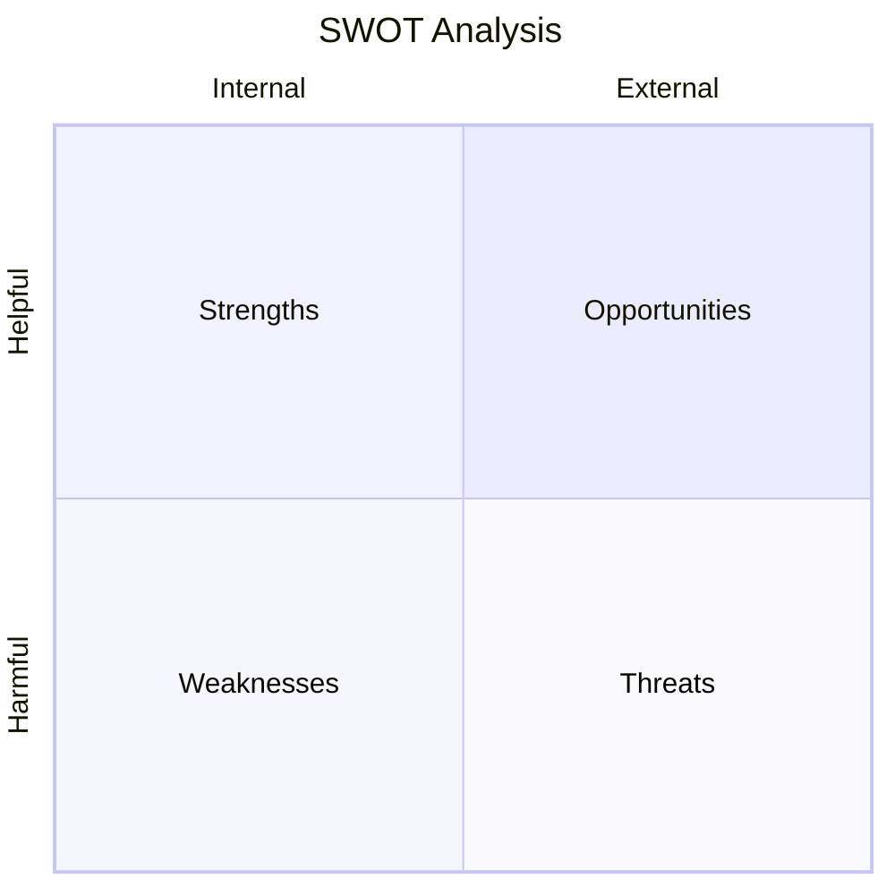

# Market Research Report: {{TOPIC}}

**Generated**: {{DATE}}
**Research Period**: {{START_DATE}} - {{END_DATE}}
**Prepared by**: sigint Market Intelligence

---

## Executive Summary

### Key Findings
1. {{FINDING_1}}
2. {{FINDING_2}}
3. {{FINDING_3}}
4. {{FINDING_4}}
5. {{FINDING_5}}

### Primary Recommendation
{{RECOMMENDATION}}

### Critical Risk
{{RISK}}

---

## Market Overview

### Market Definition
{{MARKET_DEFINITION}}

### Current State
{{CURRENT_STATE}}

### Key Players
| Company | Market Share | Position | Trend |
|---------|--------------|----------|-------|
| {{PLAYER_1}} | {{SHARE_1}} | {{POS_1}} | {{TREND_1}} |
| {{PLAYER_2}} | {{SHARE_2}} | {{POS_2}} | {{TREND_2}} |
| {{PLAYER_3}} | {{SHARE_3}} | {{POS_3}} | {{TREND_3}} |
| Others | {{SHARE_OTHERS}} | - | - |

---

## Market Sizing

### TAM/SAM/SOM Analysis

| Metric | Value | Growth (CAGR) | Trend |
|--------|-------|---------------|-------|
| **TAM** | {{TAM_VALUE}} | {{TAM_GROWTH}} | {{TAM_TREND}} |
| **SAM** | {{SAM_VALUE}} | {{SAM_GROWTH}} | {{SAM_TREND}} |
| **SOM** | {{SOM_VALUE}} | - | - |

### Methodology
{{SIZING_METHODOLOGY}}

### Key Assumptions
1. {{ASSUMPTION_1}}
2. {{ASSUMPTION_2}}
3. {{ASSUMPTION_3}}

---

## Competitive Landscape

### Porter's Five Forces

| Force | Rating | Analysis |
|-------|--------|----------|
| Competitive Rivalry | {{RIVALRY_RATING}} | {{RIVALRY_ANALYSIS}} |
| Supplier Power | {{SUPPLIER_RATING}} | {{SUPPLIER_ANALYSIS}} |
| Buyer Power | {{BUYER_RATING}} | {{BUYER_ANALYSIS}} |
| Threat of Substitutes | {{SUBSTITUTE_RATING}} | {{SUBSTITUTE_ANALYSIS}} |
| Threat of New Entry | {{ENTRY_RATING}} | {{ENTRY_ANALYSIS}} |

### Competitive Positioning Map

```mermaid
quadrantChart
    title Competitive Positioning
    x-axis Low Price --> High Price
    y-axis Low Features --> High Features
    quadrant-1 Premium
    quadrant-2 Feature Leaders
    quadrant-3 Budget
    quadrant-4 Value
    {{POSITIONING_DATA}}
```

---

## Trend Analysis

### Macro Trends

| Trend | Direction | Confidence | Timeframe |
|-------|-----------|------------|-----------|
| {{MACRO_1}} | {{DIR_1}} | {{CONF_1}} | {{TIME_1}} |
| {{MACRO_2}} | {{DIR_2}} | {{CONF_2}} | {{TIME_2}} |
| {{MACRO_3}} | {{DIR_3}} | {{CONF_3}} | {{TIME_3}} |

### Micro Trends

| Trend | Direction | Confidence | Timeframe |
|-------|-----------|------------|-----------|
| {{MICRO_1}} | {{MDIR_1}} | {{MCONF_1}} | {{MTIME_1}} |
| {{MICRO_2}} | {{MDIR_2}} | {{MCONF_2}} | {{MTIME_2}} |

### Transitional Scenario Graph

```mermaid
stateDiagram-v2
    [*] --> CurrentState

    CurrentState --> {{SCENARIO_1}}: {{TRANSITION_1}}
    CurrentState --> {{SCENARIO_2}}: {{TRANSITION_2}}
    CurrentState --> {{SCENARIO_3}}: {{TRANSITION_3}}

    {{SCENARIO_1}} --> {{TERMINAL_1}}: {{PATH_1}}
    {{SCENARIO_2}} --> {{TERMINAL_2}}: {{PATH_2}}
    {{SCENARIO_3}} --> {{TERMINAL_3}}: {{PATH_3}}
```

### Terminal Scenarios

**{{TERMINAL_1}}**
- Conditions: {{TERMINAL_1_CONDITIONS}}
- Trade-offs: {{TERMINAL_1_TRADEOFFS}}
- Probability: {{TERMINAL_1_PROB}}

**{{TERMINAL_2}}**
- Conditions: {{TERMINAL_2_CONDITIONS}}
- Trade-offs: {{TERMINAL_2_TRADEOFFS}}
- Probability: {{TERMINAL_2_PROB}}

---

## SWOT Analysis



### Strengths
- {{STRENGTH_1}}
- {{STRENGTH_2}}
- {{STRENGTH_3}}

### Weaknesses
- {{WEAKNESS_1}}
- {{WEAKNESS_2}}
- {{WEAKNESS_3}}

### Opportunities
- {{OPPORTUNITY_1}}
- {{OPPORTUNITY_2}}
- {{OPPORTUNITY_3}}

### Threats
- {{THREAT_1}}
- {{THREAT_2}}
- {{THREAT_3}}

---

## Recommendations

### Strategic Recommendations

#### 1. {{REC_TITLE_1}} ({{REC_PRIORITY_1}})
**What**: {{REC_WHAT_1}}
**Why**: {{REC_WHY_1}}
**How**: {{REC_HOW_1}}
**Risk**: {{REC_RISK_1}}

#### 2. {{REC_TITLE_2}} ({{REC_PRIORITY_2}})
**What**: {{REC_WHAT_2}}
**Why**: {{REC_WHY_2}}
**How**: {{REC_HOW_2}}
**Risk**: {{REC_RISK_2}}

#### 3. {{REC_TITLE_3}} ({{REC_PRIORITY_3}})
**What**: {{REC_WHAT_3}}
**Why**: {{REC_WHY_3}}
**How**: {{REC_HOW_3}}
**Risk**: {{REC_RISK_3}}

### Tactical Next Steps (30 days)
1. {{NEXT_STEP_1}}
2. {{NEXT_STEP_2}}
3. {{NEXT_STEP_3}}

---

## Risk Assessment

### Risk Matrix

| Risk | Probability | Impact | Trend | Mitigation |
|------|-------------|--------|-------|------------|
| {{RISK_1}} | {{PROB_1}} | {{IMPACT_1}} | {{RTREND_1}} | {{MIT_1}} |
| {{RISK_2}} | {{PROB_2}} | {{IMPACT_2}} | {{RTREND_2}} | {{MIT_2}} |
| {{RISK_3}} | {{PROB_3}} | {{IMPACT_3}} | {{RTREND_3}} | {{MIT_3}} |

### Monitoring Indicators
- {{INDICATOR_1}}
- {{INDICATOR_2}}
- {{INDICATOR_3}}

---

## Appendix

### Data Sources

| Source | Type | Date | Reliability |
|--------|------|------|-------------|
| {{SOURCE_1}} | {{TYPE_1}} | {{SDATE_1}} | {{REL_1}} |
| {{SOURCE_2}} | {{TYPE_2}} | {{SDATE_2}} | {{REL_2}} |
| {{SOURCE_3}} | {{TYPE_3}} | {{SDATE_3}} | {{REL_3}} |

### Methodology Notes
{{METHODOLOGY_NOTES}}

### Research Timeline
{{RESEARCH_TIMELINE}}

---

*Report generated by sigint Market Intelligence Plugin*
*Trend indicators: INC (↑), DEC (↓), CONST (→)*
