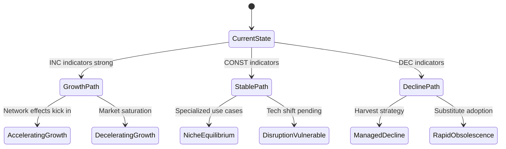

# Trend Analysis

## Overview

Trend analysis identifies patterns of change over time to anticipate future market conditions. This skill covers methodologies for discovering, validating, and projecting trends at macro and micro levels.

## Trend Categories

### Macro Trends (3-10+ years)
Large-scale shifts affecting multiple industries:
- **Economic**: Interest rates, inflation, employment
- **Technological**: AI, blockchain, quantum computing
- **Social**: Demographics, values, behaviors
- **Environmental**: Climate, sustainability, resources
- **Political**: Regulation, trade, governance

### Micro Trends (1-3 years)
Industry or segment-specific patterns:
- Feature adoption curves
- Pricing model shifts
- Channel preferences
- Buying behavior changes
- Competitive dynamics

### Emerging Signals (< 1 year)
Early indicators of potential trends:
- Startup activity
- Patent filings
- Research papers
- Early adopter behavior
- Influencer attention

## Three-Valued Trend Logic

From the trend-based modeling research, apply minimal-information quantifiers:

**INC (Increasing)**
- Measurable upward movement
- Multiple confirming signals
- Example: "AI adoption growing 40% YoY"

**DEC (Decreasing)**
- Measurable downward movement
- Multiple confirming signals
- Example: "On-premise deployments declining 15% annually"

**CONST (Constant)**
- No significant directional movement
- OR insufficient data to determine direction
- Example: "Market share stable at ~30%"

### Correlation-to-Trend Conversion

Convert data relationships to trend indicators:
- Positive correlation (r > 0.3) → INC relationship
- Negative correlation (r < -0.3) → DEC relationship
- Weak correlation (-0.3 < r < 0.3) → CONST relationship

## Trend Identification Process

### Step 1: Signal Gathering
Collect data points from:
- Industry reports and analyses
- News and publications
- Patent databases
- Job posting trends
- Search interest (Google Trends)
- Social media discussions
- Conference topics
- Funding announcements

### Step 2: Pattern Recognition
Look for:
- Consistent direction over 3+ time periods
- Acceleration/deceleration in rate of change
- Cross-industry convergence
- Discontinuities and inflection points

### Step 3: Validation
Confirm trends through:
- Multiple independent sources
- Expert opinions
- Historical analogies
- Quantitative data where available

### Step 4: Classification
Assign trend direction:
- Determine INC/DEC/CONST
- Note confidence level
- Document supporting evidence

### Step 5: Projection
Extend trends forward considering:
- Historical trajectory
- Accelerating/decelerating forces
- Potential disruptions
- Saturation points

## Transitional Scenario Graphs

Create Mermaid state diagrams showing possible futures:



### Terminal Scenarios

Identify equilibrium states where trends stabilize:
- What market structure emerges?
- Which players win/lose?
- What trade-offs must organizations accept?

## Trend Quality Assessment

Rate trend confidence:

| Confidence | Evidence Required |
|------------|-------------------|
| High | 3+ independent sources, quantitative data, expert consensus |
| Medium | 2+ sources, qualitative signals, some disagreement |
| Low | Single source, early signals, speculative |

## Output Structure

```markdown
## Trend Analysis Summary

### Macro Trends
| Trend | Direction | Confidence | Timeframe |
|-------|-----------|------------|-----------|
| [Name] | INC/DEC/CONST | High/Med/Low | X years |

### Micro Trends
| Trend | Direction | Confidence | Timeframe |
|-------|-----------|------------|-----------|
| [Name] | INC/DEC/CONST | High/Med/Low | X months |

### Emerging Signals
- [Signal 1]: [Potential implication]
- [Signal 2]: [Potential implication]

## Transitional Scenario Graph
[Mermaid diagram]

## Terminal Scenarios
1. **[Scenario Name]**: [Description and conditions]
2. **[Scenario Name]**: [Description and conditions]

## Implications
- [Implication 1]
- [Implication 2]

## Monitoring Indicators
- [Metric to track]
- [Metric to track]
```

## Best Practices

- **Multiple timeframes**: Analyze short, medium, and long-term
- **Cross-validate**: Use diverse sources and methods
- **Update regularly**: Trends can shift; review quarterly
- **Note uncertainty**: Distinguish confidence levels clearly
- **Watch for reversals**: Monitor for trend changes
- **Consider second-order effects**: What does the trend cause?

## Common Pitfalls

- Confirmation bias (seeing trends you expect)
- Recency bias (overweighting recent data)
- Survivorship bias (only seeing successful trends)
- Extrapolation without limits (trends don't continue forever)
- Ignoring counter-trends (opposing forces)

## Additional Resources

For detailed methodologies, see:
- `references/trend-signals.md` - Signal identification techniques
- `references/scenario-planning.md` - Scenario development methods
- `examples/trend-report.md` - Sample trend analysis
