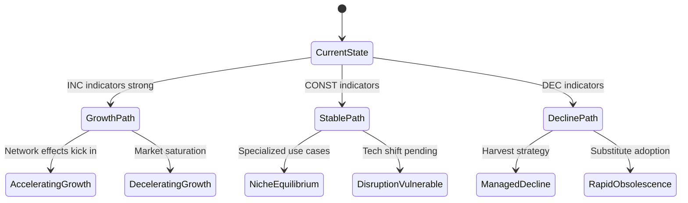

# Trend Analysis

## Overview

Trend analysis identifies patterns of change over time to anticipate future market conditions. This skill covers methodologies for discovering, validating, and projecting trends at macro and micro levels.

## Required Frameworks

| Framework | Output Section | Required | Condition |
|-----------|---------------|----------|-----------|
| Macro Trends Table | Macro Trends | yes | — |
| Micro Trends Table | Micro Trends | yes | — |
| Emerging Signals | Emerging Signals | yes | — |
| Transitional Scenario Graph | Transitional Scenario Graph | yes | — |
| Terminal Scenarios | Terminal Scenarios | yes | — |
| Monitoring Indicators | Monitoring Indicators | yes | — |

## Trend Categories

### Macro Trends (3-10+ years)
Large-scale shifts affecting multiple industries. **Always classify each macro trend into one of these five categories and label it explicitly**:
- **Economic**: Interest rates, inflation, employment, trade flows, pricing pressure
- **Technological**: AI, blockchain, quantum computing, automation, platform shifts
- **Social**: Demographics, values, behaviors, workforce changes, cultural shifts
- **Environmental**: Climate, sustainability, resources, regulatory carbon targets
- **Political**: Regulation, trade policy, governance, geopolitical risk

When presenting macro trends, include the category label (e.g., "Technological: AI-driven precision agriculture") so the classification is visible in the output.

### Micro Trends (1-3 years)
Industry or segment-specific patterns:
- Feature adoption curves
- Pricing model shifts
- Channel preferences
- Buying behavior changes
- Competitive dynamics

### Emerging Signals (< 1 year)
Early indicators of potential trends:
- Startup activity
- Patent filings
- Research papers
- Early adopter behavior
- Influencer attention

**For each emerging signal, always state what it may indicate or suggest** using language such as "This signal suggests...", "This may indicate...", "The implication is...", or "This points to...". Every signal must be paired with its potential implication.

## Three-Valued Trend Logic

Load and apply the trend indicator definitions from `protocols/TREND-INDICATORS.md`. When explaining the system, always introduce all three values (INC, DEC, CONST) together in a single summary before elaborating on each.

## Trend Identification Process

### Step 1: Signal Gathering
Collect data points from:
- Industry reports and analyses
- News and publications
- Patent databases
- Job posting trends
- Search interest (Google Trends)
- Social media discussions
- Conference topics
- Funding announcements

### Step 2: Pattern Recognition
Look for:
- Consistent direction over 3+ time periods
- Acceleration/deceleration in rate of change
- Cross-industry convergence
- Discontinuities and inflection points

### Step 3: Validation
Confirm trends through:
- Multiple independent sources
- Expert opinions
- Historical analogies
- Quantitative data where available

### Step 4: Classification
Assign trend direction:
- Determine INC/DEC/CONST
- Note confidence level
- Document supporting evidence

### Step 5: Projection
Extend trends forward considering:
- Historical trajectory
- Accelerating/decelerating forces
- Potential disruptions
- Saturation points

## Transitional Scenario Graphs

Create Mermaid state diagrams showing possible futures:


```mermaid
stateDiagram-v2
    [*] --> CurrentState

    CurrentState --> GrowthPath: INC indicators strong
    CurrentState --> StablePath: CONST indicators
    CurrentState --> DeclinePath: DEC indicators

    GrowthPath --> AcceleratingGrowth: Network effects kick in
    GrowthPath --> DeceleratingGrowth: Market saturation

    StablePath --> NicheEquilibrium: Specialized use cases
    StablePath --> DisruptionVulnerable: Tech shift pending

    DeclinePath --> ManagedDecline: Harvest strategy
    DeclinePath --> RapidObsolescence: Substitute adoption
```

### Terminal Scenarios

Identify equilibrium states where trends stabilize:
- What market structure emerges?
- Which players win/lose?
- What trade-offs must organizations accept?

## Trend Quality Assessment

Rate trend confidence:

| Confidence | Evidence Required |
|------------|-------------------|
| High | 3+ independent sources, quantitative data, expert consensus |
| Medium | 2+ sources, qualitative signals, some disagreement |
| Low | Single source, early signals, speculative |

## Output Structure

```markdown
## Trend Analysis Summary

### Macro Trends
| Category | Trend | Direction | Confidence | Timeframe |
|----------|-------|-----------|------------|-----------|
| Economic/Technological/Social/Environmental/Political | [Name] | INC/DEC/CONST | High/Med/Low | X years |

### Micro Trends
| Trend | Direction | Confidence | Timeframe |
|-------|-----------|------------|-----------|
| [Name] | INC/DEC/CONST | High/Med/Low | X months |

### Emerging Signals
- [Signal 1]: This suggests/indicates [potential implication]
- [Signal 2]: This suggests/indicates [potential implication]

## Transitional Scenario Graph
[Mermaid diagram]

## Terminal Scenarios
1. **[Scenario Name]**: [Description and conditions]
2. **[Scenario Name]**: [Description and conditions]

## Implications
- [Implication 1]
- [Implication 2]

## Monitoring Indicators
- [Metric to track]
- [Metric to track]
```

## Best Practices

- **Multiple timeframes**: Analyze short, medium, and long-term
- **Cross-validate**: Use diverse sources and methods
- **Update regularly**: Trends can shift; review quarterly
- **Note uncertainty**: Distinguish confidence levels clearly
- **Watch for reversals**: Monitor for trend changes
- **Consider second-order effects**: What does the trend cause?

## Common Pitfalls

- Confirmation bias (seeing trends you expect)
- Recency bias (overweighting recent data)
- Survivorship bias (only seeing successful trends)
- Extrapolation without limits (trends don't continue forever)
- Ignoring counter-trends (opposing forces)

## Additional Resources

For detailed methodologies, see:
- `references/trend-signals.md` - Signal identification techniques
- `references/scenario-planning.md` - Scenario development methods
- `examples/trend-report.md` - Sample trend analysis

## Orchestration Hints

**Confidence tiers (universal scale):**
- **High**: 3+ independent, recent (<12mo) sources that converge
- **Medium**: 2 sources OR sources >12mo old OR indirect evidence
- **Low**: Single source, inference, or extrapolation

Dimension-specific confidence criteria below REFINE (not replace) these universal definitions.

- **Cross-reference dimensions**: tech (adoption curves, technology maturity), regulatory (regulatory shifts impacting trends)
- **Alert triggers**:
  - Trend reversal detected (INC→DEC or DEC→INC)
  - Emerging trend with potential to reshape market within 2 years
  - Macro trend contradiction between sources
- **Confidence rules**:
  - High: 3+ independent signals confirm trend direction
  - Medium: 2 signals or strong single indicator with historical precedent
  - Low: Single signal or conflicting indicators
- **Conflict detection**:
  - Trend projections vs sizing dimension's growth rates
  - Technology adoption curves vs tech dimension's TRL assessments
  - Regulatory trend impacts vs regulatory dimension's timeline estimates
