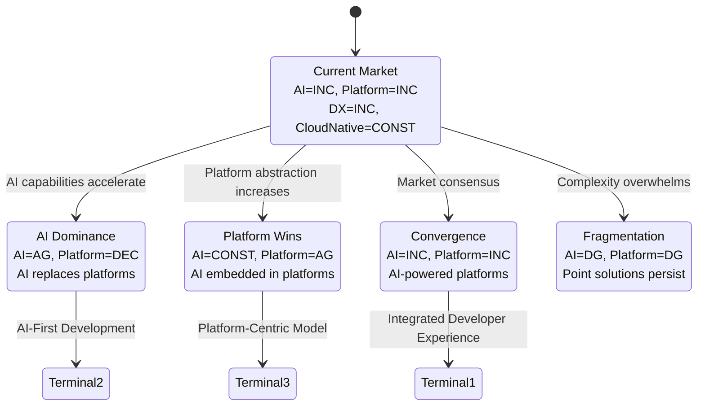

# Trend Analysis: Developer Tools Market

**Date**: 2024-Q4
**Scope**: Developer productivity and tooling trends
**Horizon**: 2024-2027

---

## Trend Analysis Summary

### Macro Trends (3-5 year horizon)

| Trend | Direction | Confidence | Impact |
|-------|-----------|------------|--------|
| AI-assisted development | INC | High | Transformational |
| Platform engineering | INC | High | High |
| Developer experience (DX) | INC | Medium | High |
| Cloud-native tooling | CONST | High | Medium |
| Low-code expansion | INC | Medium | Medium |

### Micro Trends (1-2 year horizon)

| Trend | Direction | Confidence | Impact |
|-------|-----------|------------|--------|
| Agentic coding tools | INC | Medium | High |
| Internal developer platforms | INC | High | High |
| AI code review adoption | INC | High | Medium |
| Observability-driven development | INC | Medium | Medium |
| Shift-left security | CONST | High | Medium |

### Emerging Signals

| Signal | Source | Potential Impact |
|--------|--------|------------------|
| LLM-powered IDEs | Startup activity | May redefine IDE category |
| AI-generated documentation | GitHub features | Reduces maintenance burden |
| Natural language coding | Research papers | Long-term paradigm shift |
| Autonomous testing | VC investments | Could automate QA roles |

---

## Trend Deep Dive: AI-Assisted Development

### Current State
- 40%+ developers using AI assistance (JetBrains Survey 2024)
- Productivity gains of 25-50% reported
- Adoption accelerating in enterprise

### Trend Indicators

| Signal | Data Point | Direction |
|--------|------------|-----------|
| GitHub Copilot users | 1.8M+ paid users | INC |
| VC funding in AI dev tools | $2.5B in 2024 | INC |
| Job postings mentioning AI tools | +180% YoY | INC |
| Enterprise pilot programs | 65% of F500 | INC |

### Trajectory Analysis

**Phase**: Early Majority adoption
**Hype Cycle Position**: Slope of Enlightenment

```
2022: Innovation Trigger (ChatGPT/Copilot)
2023: Peak of Inflated Expectations
2024: Trough of Disillusionment (accuracy concerns)
2025: Slope of Enlightenment (current position)
2026+: Plateau of Productivity
```

### Implications
- AI assistance becomes table stakes for IDEs
- Developer productivity expectations increase
- Junior developer role evolution
- Training and enablement investment required

---

## Trend Deep Dive: Platform Engineering

### Current State
- 70% of organizations exploring internal developer platforms
- Driven by DevOps maturity and complexity management
- Backstage (Spotify) established as de facto standard

### Trend Indicators

| Signal | Data Point | Direction |
|--------|------------|-----------|
| Platform engineering job postings | +250% YoY | INC |
| Backstage adoption | 2000+ companies | INC |
| Internal platform investments | Avg $2M/year enterprise | INC |
| Conference tracks dedicated | All major DevOps conferences | INC |

### Trajectory Analysis

**Phase**: Early Adopter → Early Majority transition
**Hype Cycle Position**: Peak approaching Trough

### Implications
- Self-service infrastructure becomes expectation
- Reduced cognitive load on developers
- Centralized tooling decisions
- Build vs. buy decisions for platform capabilities

---

## Transitional Scenario Graph



### Most Likely Path
**CurrentState → ScenarioC (Convergence)** with 60% probability

AI capabilities get embedded into platform engineering tools, creating integrated developer experiences. Neither AI tools nor platforms dominate independently.

---

## Terminal Scenarios

### Scenario: Integrated Developer Experience (Most Likely)

**Configuration**: AI=INC, Platform=INC, DX=INC

**What This Looks Like**:
- AI assistance embedded throughout development lifecycle
- Internal developer platforms orchestrate AI capabilities
- Unified experiences across code, deploy, observe
- Natural language interfaces for infrastructure

**Conditions That Lead Here**:
- Continued AI improvement without paradigm shift
- Platform engineering matures
- Enterprise adoption accelerates

**Strategic Implications**:
- Invest in platform + AI integration capabilities
- Focus on developer experience holistically
- Build or buy AI-enhanced platform features

---

## Monitoring Indicators

### Leading Indicators (Watch Now)

| Indicator | Source | Threshold |
|-----------|--------|-----------|
| AI tool daily active usage | Product analytics | >50% of developers |
| Platform adoption in F500 | Analyst surveys | >60% |
| VC funding shifts | Crunchbase | Category leadership |
| Open source momentum | GitHub stars/forks | 10x growth |

### Lagging Indicators (Confirmation)

| Indicator | Source | Threshold |
|-----------|--------|-----------|
| Developer productivity metrics | Industry surveys | >30% improvement |
| Platform engineering hiring | LinkedIn | Dedicated roles in 80%+ |
| Tool consolidation | M&A activity | Major acquisitions |

---

## Implications by Role

### For Product Teams
- Prioritize AI-enhanced features
- Consider platform integration strategy
- Invest in developer experience research

### For Engineering Teams
- Evaluate AI tool adoption
- Plan for platform engineering function
- Prepare for workflow changes

### For Investors
- AI dev tools remain attractive
- Platform engineering consolidation opportunity
- Watch for AI/platform convergence plays

---

## Key Uncertainties

| Uncertainty | If High | If Low |
|-------------|---------|--------|
| AI improvement rate | Accelerates adoption | Slower transition |
| Enterprise security concerns | Slows enterprise adoption | Faster adoption |
| Economic conditions | Focus on efficiency | Investment in DX |
| Regulatory environment | More compliance tooling | Faster innovation |

---

## Recommendations

1. **Accept AI-assistance as inevitable**
   - Plan for 80%+ developer adoption by 2026
   - Invest in training and enablement

2. **Start platform engineering journey**
   - Assess internal developer experience
   - Pilot internal developer platform
   - Build or buy strategy

3. **Monitor convergence signals**
   - Watch AI-platform integration announcements
   - Track developer experience metrics
   - Adjust strategy as market evolves

---

## Data Sources

- JetBrains: "State of Developer Ecosystem 2024"
- Stack Overflow: "Developer Survey 2024"
- Gartner: "Hype Cycle for Application Development, 2024"
- CNCF: "Annual Survey 2024"
- Crunchbase: Funding data
- LinkedIn: Job posting analysis
- GitHub: Open source activity metrics
