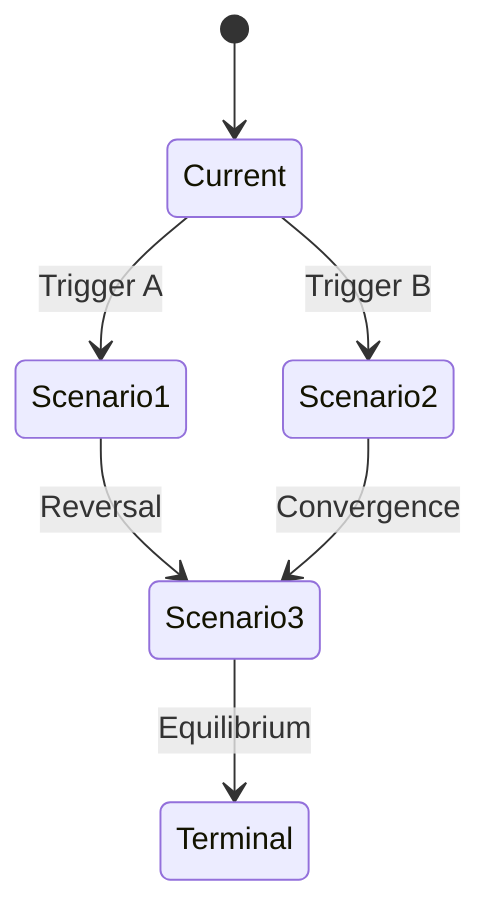

# Scenario Planning Methods

## Overview

Scenario planning develops multiple plausible futures to inform strategic decisions under uncertainty. Unlike forecasting (predicting one future), scenarios explore a range of possibilities.

## Core Concepts

### What Scenarios Are
- Plausible future states
- Internally consistent narratives
- Distinct from each other
- Relevant to strategic decisions

### What Scenarios Are NOT
- Predictions or forecasts
- Best/worst case extremes only
- Wishful thinking
- Exhaustive possibilities

---

## Scenario Development Process

### Step 1: Define Focal Question
What strategic decision are you trying to inform?

**Good Questions**:
- "How should we position in the market over 5 years?"
- "What capabilities should we build?"
- "Where should we invest?"

**Poor Questions**:
- "What will happen?" (too vague)
- "Will our product succeed?" (yes/no, not exploratory)

### Step 2: Identify Key Drivers

**PESTLE Framework**:
- **P**olitical: Regulation, trade policy
- **E**conomic: Growth, interest rates
- **S**ocial: Demographics, behaviors
- **T**echnological: Innovation, adoption
- **L**egal: Laws, litigation
- **E**nvironmental: Climate, resources

### Step 3: Assess Uncertainty & Impact

Plot drivers on 2x2:

```
High Impact
    │
    │  Critical      │  Key
    │  Uncertainties │  Drivers
    │                │
────┼────────────────┼────────────
    │                │
    │  Monitor       │  Background
    │                │
    │
              Low Impact
    Low Uncertainty ────► High Uncertainty
```

Focus on **Critical Uncertainties** (high impact + high uncertainty)

### Step 4: Define Scenario Axes

Select two critical uncertainties as axes:

```
        Uncertainty A: High
              │
    Scenario │ Scenario
       2     │    1
              │
──────────────┼──────────────
              │
    Scenario │ Scenario
       3     │    4
              │
        Uncertainty A: Low

    Uncertainty B: Low ──► High
```

### Step 5: Build Scenario Narratives

For each quadrant, develop:
1. **Name**: Memorable, descriptive
2. **Description**: What this world looks like
3. **Key characteristics**: Defining features
4. **Path to scenario**: How we get there
5. **Implications**: What it means for strategy

### Step 6: Identify Signposts

What would indicate we're heading toward each scenario?
- Early warning signals
- Monitoring metrics
- Decision triggers

---

## Scenario Types

### Exploratory Scenarios
- Explore range of possibilities
- No probability assigned
- Equal attention to each
- Best for uncertain environments

### Normative Scenarios
- Define desired end state
- Work backward to present
- Identify path to goal
- Best for strategy development

### Probability-Weighted Scenarios
- Assign likelihoods
- Focus on most probable
- Used in financial modeling
- Risk: false precision

---

## Three-Valued Logic Integration

Connect scenarios to trend-based modeling:

| Variable | Scenario 1 | Scenario 2 | Scenario 3 |
|----------|-----------|-----------|-----------|
| Market Growth | INC | CONST | DEC |
| Competition | INC | INC | DEC |
| Regulation | INC | CONST | INC |

### Transitional Scenario Graphs

Show how scenarios connect:



---

## Scenario Quality Criteria

### Good Scenarios Are:
- **Plausible**: Could actually happen
- **Distinct**: Meaningfully different
- **Consistent**: Internally logical
- **Relevant**: Address focal question
- **Challenging**: Stretch thinking
- **Memorable**: Easy to reference

### Common Pitfalls:
- Good/bad framing (oversimplified)
- Business-as-usual bias
- Ignoring uncomfortable scenarios
- Too many scenarios (>4 becomes unwieldy)
- Not actionable

---

## Using Scenarios Strategically

### Strategy Testing
For each scenario, ask:
- Does our current strategy work?
- What would we need to change?
- What's the risk/reward?

### Robust Strategy Development
Find strategies that work across multiple scenarios:
- Identify no-regret moves
- Build strategic options
- Develop contingency plans

### Monitoring & Adaptation
- Track signposts regularly
- Adjust strategy as signals emerge
- Update scenarios as world changes

---

## Scenario Documentation Template

```markdown
## Scenario: [Name]

### Summary
[2-3 sentence description]

### Key Characteristics
- [Characteristic 1]
- [Characteristic 2]
- [Characteristic 3]

### Trend Profile
| Variable | Direction |
|----------|-----------|
| [Var 1] | INC/DEC/CONST |
| [Var 2] | INC/DEC/CONST |

### Path to This Scenario
1. [Event/development 1]
2. [Event/development 2]
3. [Event/development 3]

### Signposts to Monitor
- [Metric/event 1]
- [Metric/event 2]

### Strategic Implications
- [Implication 1]
- [Implication 2]

### Key Actions if Emerging
- [Action 1]
- [Action 2]
```

---

## References

Schwartz, P. (1991). *The Art of the Long View*. Doubleday.
van der Heijden, K. (2005). *Scenarios: The Art of Strategic Conversation*. Wiley.
Shell International. (2003). *Scenarios: An Explorer's Guide*.
