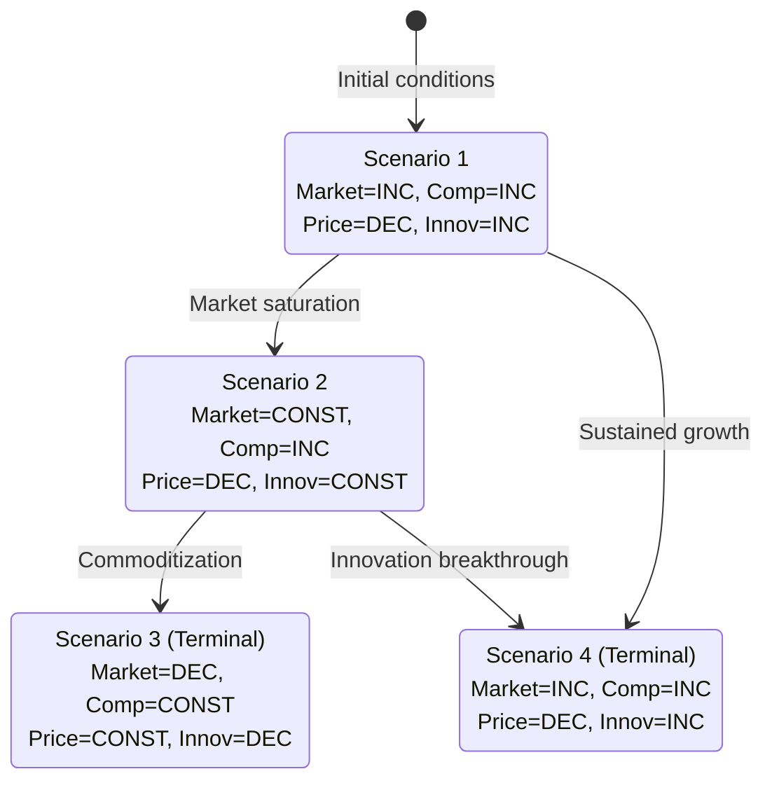

# Trend Modeling with Three-Valued Logic

## Overview

Based on research in trend-based optimization for product innovation, this skill applies three-valued logic (increasing/decreasing/constant) to analyze markets when precise numerical data is unavailable. This approach enables meaningful analysis with minimal information.

## Core Concept

Traditional market analysis requires extensive quantitative data. Three-valued logic provides an alternative when:
- Data is scarce or unreliable
- Relationships are qualitative
- Uncertainty is high
- Quick directional insights are needed

## The Three Values

### INC (Increasing)
- Variable is trending upward
- Rate of increase may be accelerating (AG) or decelerating (DG)
- Symbol: ↑ or (+)

### DEC (Decreasing)
- Variable is trending downward
- Rate of decrease may be accelerating (AD) or decelerating (DD)
- Symbol: ↓ or (-)

### CONST (Constant)
- Variable is stable or unchanged
- OR insufficient data to determine direction
- Symbol: → or (=)

## Extended Notation

For more nuanced analysis:

| Code | Meaning | Description |
|------|---------|-------------|
| AG | Accelerating Growth | INC with increasing rate |
| DG | Decelerating Growth | INC with decreasing rate |
| AD | Accelerating Decrease | DEC with increasing rate |
| DD | Decelerating Decrease | DEC with decreasing rate |

## Correlation-to-Trend Conversion

Transform correlation relationships into trend relationships:

**If variables X and Y have positive correlation:**
- When X is INC → Y is INC
- When X is DEC → Y is DEC
- Notation: INC(X, Y)

**If variables X and Y have negative correlation:**
- When X is INC → Y is DEC
- When X is DEC → Y is INC
- Notation: DEC(X, Y)

**Example:**
- Market size and competition have positive correlation
- If Market Size = INC, then Competition = INC
- If Market Size = DEC, then Competition = DEC

## Trend Model Construction

### Step 1: Identify Variables
List market variables of interest:
- Market size
- Competition intensity
- Price pressure
- Innovation rate
- Customer adoption
- Regulatory burden

### Step 2: Determine Relationships
For each pair of variables:
- Identify correlation direction (positive/negative)
- Convert to trend relationship (INC/DEC)

### Step 3: Build Trend Matrix

| Variable | Market Size | Competition | Price | Innovation |
|----------|-------------|-------------|-------|------------|
| Market Size | - | INC | DEC | INC |
| Competition | INC | - | DEC | CONST |
| Price | DEC | DEC | - | DEC |
| Innovation | INC | CONST | DEC | - |

### Step 4: Generate Scenarios
A scenario is a consistent assignment of INC/DEC/CONST to all variables that satisfies all relationships.

### Step 5: Identify Terminal Scenarios
Terminal scenarios are equilibrium states where:
- All relationships are satisfied
- System is stable
- No further transitions occur

## Transitional Scenario Graphs

Create Mermaid diagrams showing scenario evolution:



## Multi-Objective Trade-offs

From the research: "No scenario satisfies all objective functions simultaneously."

When analyzing terminal scenarios:
1. Identify competing objectives
2. Map which scenarios favor which objectives
3. Highlight trade-offs required
4. Recommend based on priority alignment

## Application to Market Analysis

### Use Case: New Market Entry

**Variables:**
- Market Growth (MG)
- Competitive Intensity (CI)
- Entry Barriers (EB)
- Customer Awareness (CA)

**Relationships:**
- INC(MG, CI) - Growing markets attract competitors
- INC(MG, CA) - Growth increases awareness
- DEC(EB, CI) - Lower barriers increase competition
- INC(CA, MG) - Awareness drives growth

**Scenarios Generated:**
1. Explosive growth: MG=AG, CI=AG, EB=DEC, CA=AG
2. Mature equilibrium: MG=DG, CI=CONST, EB=CONST, CA=CONST
3. Consolidation: MG=DEC, CI=DEC, EB=INC, CA=CONST

## Output Structure

```markdown
## Trend Model Summary

### Variables
| Variable | Current State | Trend | Confidence |
|----------|---------------|-------|------------|
| [Name] | [Description] | INC/DEC/CONST | High/Med/Low |

### Relationship Matrix
[Matrix showing INC/DEC relationships]

### Generated Scenarios
| Scenario | Var1 | Var2 | Var3 | Terminal? |
|----------|------|------|------|-----------|
| S1 | INC | DEC | CONST | No |
| S2 | CONST | CONST | DEC | Yes |

### Transitional Graph
[Mermaid state diagram]

### Terminal Scenario Analysis
**Scenario X**: [Description]
- Conditions: [What leads here]
- Trade-offs: [What must be sacrificed]
- Recommendation: [Strategic implication]

### Key Insights
1. [Insight about scenario transitions]
2. [Insight about trade-offs]
```

## Best Practices

- **Start simple**: Begin with 4-6 variables
- **Validate relationships**: Check with domain experts
- **Document uncertainty**: Note where relationships are speculative
- **Update iteratively**: Refine model as new information emerges
- **Focus on transitions**: The paths between scenarios often matter more than endpoints

## Advantages of This Approach

From the research:
- "No numerical values of constants or parameters are needed"
- "A complete list of all futures/histories is obtained"
- "Results remain easy to understand without knowledge of sophisticated mathematical tools"

## Additional Resources

For theoretical background and advanced techniques, see:
- `references/three-valued-logic.md` - Theoretical foundation
- `references/scenario-generation.md` - Algorithm details
- `examples/trend-model-example.md` - Worked example
