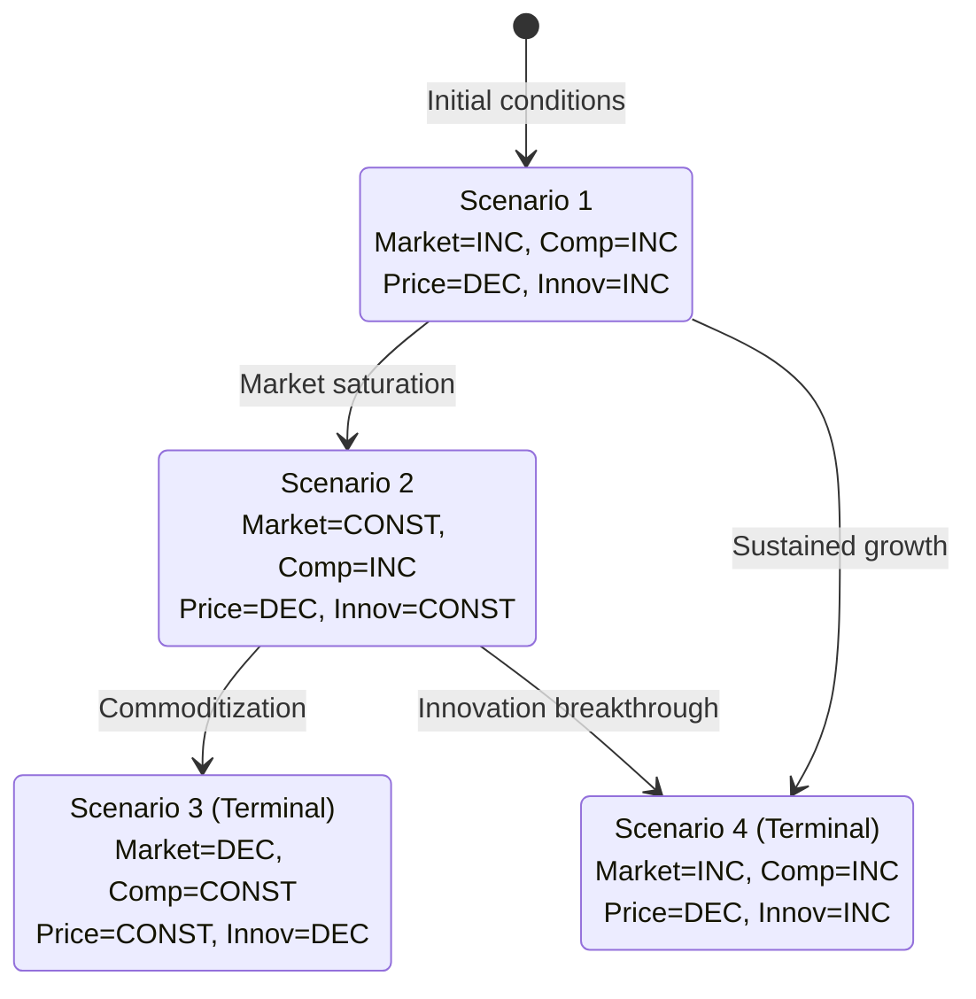

# Trend Modeling with Three-Valued Logic

## Overview

Based on research in trend-based optimization for product innovation, this skill applies three-valued logic (increasing/decreasing/constant) to analyze markets when precise numerical data is unavailable. This approach enables meaningful analysis with minimal information.

## Required Frameworks

| Framework | Output Section | Required | Condition |
|-----------|---------------|----------|-----------|
| Variables Table | Variables | yes | — |
| Relationship Matrix | Relationship Matrix | yes | — |
| Scenario Generation | Generated Scenarios | yes | — |
| Transitional Graph | Transitional Scenario Graph (Mermaid stateDiagram) | yes | — |
| Terminal Scenario Analysis | Terminal Scenario Analysis | yes | — |
| Multi-Objective Trade-offs | Trade-offs | yes | — |

## Core Concept

Traditional market analysis requires extensive quantitative data. Three-valued logic provides an alternative when:
- Data is scarce or unreliable
- Relationships are qualitative
- Uncertainty is high
- Quick directional insights are needed

## The Three Values

Load and apply the trend indicator definitions from `protocols/TREND-INDICATORS.md`. This skill uses the **formal notation** variant (`INC(X, Y)`, `DEC(X, Y)`) and the **extended notation** (AG, DG, AD, DD) for acceleration/deceleration modifiers. See the protocol for full definitions.

**CRITICAL**: When the user provides correlation data, you MUST:
1. Explicitly label each correlation as "positive correlation" or "negative correlation"
2. Use the `INC(X, Y)` or `DEC(X, Y)` notation format for each relationship
3. Show the conversion step clearly before building the relationship matrix

**Example:**
- Market size and competition have **positive correlation** → `INC(Market Size, Competition)`
- If Market Size = INC, then Competition = INC
- If Market Size = DEC, then Competition = DEC
- Price and demand have **negative correlation** → `DEC(Price, Demand)`
- If Price = INC, then Demand = DEC
- If Price = DEC, then Demand = INC

## Trend Model Construction

### Step 1: Identify Variables
List market variables of interest:
- Market size
- Competition intensity
- Price pressure
- Innovation rate
- Customer adoption
- Regulatory burden

### Step 2: Determine Relationships
For each pair of variables:
- Identify correlation direction (positive/negative)
- Convert to trend relationship (INC/DEC)

### Step 3: Build Trend Matrix

| Variable | Market Size | Competition | Price | Innovation |
|----------|-------------|-------------|-------|------------|
| Market Size | - | INC | DEC | INC |
| Competition | INC | - | DEC | CONST |
| Price | DEC | DEC | - | DEC |
| Innovation | INC | CONST | DEC | - |

### Step 4: Generate Scenarios
A scenario is a consistent assignment of INC/DEC/CONST to all variables that satisfies all relationships.

### Step 5: Identify Terminal Scenarios
Terminal scenarios are equilibrium states where:
- All relationships are satisfied
- System is stable
- No further transitions occur

## Transitional Scenario Graphs

Create Mermaid diagrams showing scenario evolution:


```mermaid
stateDiagram-v2
    [*] --> S1: Initial conditions

    S1: Scenario 1<br/>Market=INC, Comp=INC<br/>Price=DEC, Innov=INC

    S2: Scenario 2<br/>Market=CONST, Comp=INC<br/>Price=DEC, Innov=CONST

    S3: Scenario 3 (Terminal)<br/>Market=DEC, Comp=CONST<br/>Price=CONST, Innov=DEC

    S4: Scenario 4 (Terminal)<br/>Market=INC, Comp=INC<br/>Price=DEC, Innov=INC

    S1 --> S2: Market saturation
    S1 --> S4: Sustained growth
    S2 --> S3: Commoditization
    S2 --> S4: Innovation breakthrough
```

## Multi-Objective Trade-offs

From the research: "No scenario satisfies all objective functions simultaneously."

When analyzing terminal scenarios:
1. Identify competing objectives
2. Map which scenarios favor which objectives
3. Highlight trade-offs required
4. Recommend based on priority alignment

## Application to Market Analysis

### Use Case: New Market Entry

**Variables:**
- Market Growth (MG)
- Competitive Intensity (CI)
- Entry Barriers (EB)
- Customer Awareness (CA)

**Relationships:**
- INC(MG, CI) - Growing markets attract competitors
- INC(MG, CA) - Growth increases awareness
- DEC(EB, CI) - Lower barriers increase competition
- INC(CA, MG) - Awareness drives growth

**Scenarios Generated:**
1. Explosive growth: MG=AG, CI=AG, EB=DEC, CA=AG
2. Mature equilibrium: MG=DG, CI=CONST, EB=CONST, CA=CONST
3. Consolidation: MG=DEC, CI=DEC, EB=INC, CA=CONST

## Output Structure

```markdown
## Trend Model Summary

### Variables
| Variable | Current State | Trend | Confidence |
|----------|---------------|-------|------------|
| [Name] | [Description] | INC/DEC/CONST | High/Med/Low |

### Relationship Matrix
[Matrix showing INC/DEC relationships]

### Generated Scenarios
| Scenario | Var1 | Var2 | Var3 | Terminal? |
|----------|------|------|------|-----------|
| S1 | INC | DEC | CONST | No |
| S2 | CONST | CONST | DEC | Yes |

### Transitional Graph
[Mermaid state diagram]

### Terminal Scenario Analysis
**Scenario X**: [Description]
- Conditions: [What leads here]
- Trade-offs: [What must be sacrificed]
- Recommendation: [Strategic implication]

### Key Insights
1. [Insight about scenario transitions]
2. [Insight about trade-offs]
```

## Best Practices

- **Start simple**: Begin with 4-6 variables
- **Validate relationships**: Check with domain experts
- **Document uncertainty**: Note where relationships are speculative
- **Update iteratively**: Refine model as new information emerges
- **Focus on transitions**: The paths between scenarios often matter more than endpoints
- **Large models (7+ variables)**: Focus the relationship matrix on direct relationships only. Not every variable pair needs a relationship — use CONST for pairs without clear correlation. Generate 3-5 key scenarios rather than exhaustively enumerating all combinations. Prioritize terminal scenarios and the most likely transitional paths.

## Advantages of This Approach

From the research:
- "No numerical values of constants or parameters are needed"
- "A complete list of all futures/histories is obtained"
- "Results remain easy to understand without knowledge of sophisticated mathematical tools"

## Additional Resources

For theoretical background and advanced techniques, see:
- `references/three-valued-logic.md` - Theoretical foundation
- `references/scenario-generation.md` - Algorithm details
- `examples/trend-model-example.md` - Worked example

## Orchestration Hints

**Confidence tiers (universal scale):**
- **High**: 3+ independent, recent (<12mo) sources that converge
- **Medium**: 2 sources OR sources >12mo old OR indirect evidence
- **Low**: Single source, inference, or extrapolation

Dimension-specific confidence criteria below REFINE (not replace) these universal definitions.

- **Cross-reference dimensions**: All dimensions provide input variables for scenario modeling
- **Alert triggers**:
  - Scenario with >50% probability of adverse outcome
  - Bifurcation point within planning horizon
  - Terminal scenario that invalidates core business assumptions
- **Confidence rules**:
  - High: Model inputs validated by 3+ dimensions' findings
  - Medium: Model inputs from 2 dimensions with reasonable assumptions
  - Low: Speculative inputs or single-dimension basis
- **Conflict detection**:
  - Scenario probabilities vs other dimensions' confidence levels
  - Trend direction assumptions vs actual trend-analysis findings
  - Timeline estimates vs regulatory and technology readiness timelines
