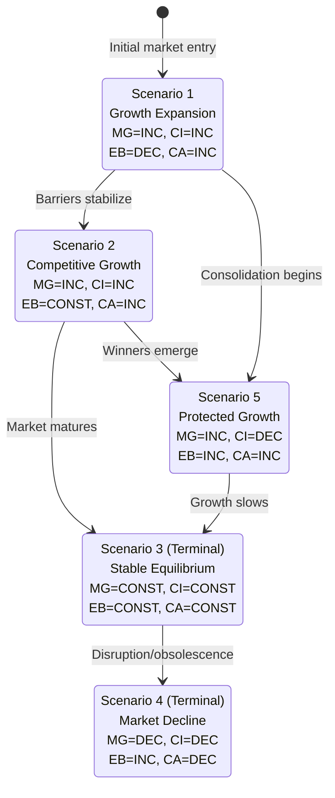

# Trend Model Example: SaaS Market Entry

**Date**: 2024-Q4
**Model Type**: Three-Valued Logic Trend Model
**Variables**: 4
**Scenarios Generated**: 5 consistent, 2 terminal

---

## Model Overview

This trend model analyzes market entry dynamics for a new SaaS product using three-valued logic (INC/DEC/CONST) to handle uncertainty without requiring precise numerical data.

---

## Variable Definitions

| Variable | Symbol | Description |
|----------|--------|-------------|
| Market Growth | MG | Overall market size trajectory |
| Competitive Intensity | CI | Number and aggression of competitors |
| Entry Barriers | EB | Difficulty for new entrants |
| Customer Awareness | CA | Target customer knowledge of solutions |

### Current State Assessment

| Variable | Current | Evidence | Confidence |
|----------|---------|----------|------------|
| MG | INC | 15% YoY growth, strong demand signals | High |
| CI | INC | 5 new entrants in 18 months | High |
| EB | CONST | No major changes to entry requirements | Medium |
| CA | INC | Search volume +40% YoY | Medium |

---

## Relationship Matrix

Define correlations between variables:

| Relationship | Type | Rationale |
|--------------|------|-----------|
| MG → CI | Positive (+) | Growing markets attract competitors |
| MG → CA | Positive (+) | Growth increases awareness |
| CI → EB | Negative (-) | More competition, higher barriers eventually |
| CA → MG | Positive (+) | Awareness drives adoption |
| EB → CI | Negative (-) | Higher barriers reduce new competition |

### Correlation Matrix

| | MG | CI | EB | CA |
|---|---|---|---|---|
| MG | - | + | 0 | + |
| CI | + | - | - | 0 |
| EB | 0 | - | - | 0 |
| CA | + | 0 | 0 | - |

---

## Scenario Generation

### All Possible Combinations: 3^4 = 81
### Consistent Scenarios: 5

Testing each combination against relationship constraints:

| # | MG | CI | EB | CA | Valid? | Reason |
|---|----|----|----|----|--------|--------|
| 1 | INC | INC | DEC | INC | ✓ | All relationships satisfied |
| 2 | INC | INC | CONST | INC | ✓ | EB can remain stable |
| 3 | CONST | CONST | CONST | CONST | ✓ | Equilibrium state |
| 4 | DEC | DEC | INC | DEC | ✓ | Declining market dynamics |
| 5 | INC | DEC | INC | INC | ✓ | Barriers limiting competition |
| 6 | INC | DEC | DEC | DEC | ✗ | Violates MG→CA (positive) |
| ... | | | | | | |

---

## Consistent Scenarios Detail

### Scenario 1: Growth Expansion
**MG=INC, CI=INC, EB=DEC, CA=INC**

- Market growing rapidly
- Competition intensifying
- Barriers lowering (commoditization)
- Awareness increasing

**Characteristics**: Early growth phase, land-grab dynamics
**Stability**: Non-terminal (will evolve)

### Scenario 2: Competitive Growth
**MG=INC, CI=INC, EB=CONST, CA=INC**

- Market growing
- Competition increasing
- Barriers holding steady
- Awareness rising

**Characteristics**: Healthy competitive market
**Stability**: Non-terminal

### Scenario 3: Stable Equilibrium (Terminal)
**MG=CONST, CI=CONST, EB=CONST, CA=CONST**

- Market mature
- Competition stable
- Barriers established
- Awareness saturated

**Characteristics**: Mature market equilibrium
**Stability**: **Terminal** - stable state

### Scenario 4: Market Decline (Terminal)
**MG=DEC, CI=DEC, EB=INC, CA=DEC**

- Market contracting
- Competitors exiting
- Barriers increasing (consolidation)
- Interest declining

**Characteristics**: End-of-lifecycle dynamics
**Stability**: **Terminal** - declining to extinction

### Scenario 5: Protected Growth
**MG=INC, CI=DEC, EB=INC, CA=INC**

- Market growing
- Competition decreasing (consolidation)
- Barriers rising
- Awareness still growing

**Characteristics**: Oligopoly formation
**Stability**: Non-terminal (moves toward Terminal)

---

## Transitional Scenario Graph

---

## Terminal Scenario Analysis

### Terminal: Stable Equilibrium (S3)

**Path to S3**: S1 → S2 → S3 (most likely)
- Growth attracts competition
- Market matures
- Equilibrium reached

**Trade-offs Accepted**:
- Limited growth potential
- Margin pressure from competition
- Innovation slows

**Strategic Posture**: Efficiency and retention focus

### Terminal: Market Decline (S4)

**Path to S4**: S3 → S4
- Technology disruption
- Customer needs shift
- Better alternatives emerge

**Trade-offs Accepted**:
- Exit or pivot required
- Asset value declines
- Talent attrition

**Strategic Posture**: Harvest or transform

---

## Strategic Implications

### Current Position: Scenario 1 (Growth Expansion)

**Optimal Strategy**:
1. **Move fast** - Market growth rewards early movers
2. **Differentiate** - Competition intensifying
3. **Build barriers** - Prepare for consolidation phase
4. **Capture awareness** - Growing but not saturated

### Scenario Monitoring

| Transition | Signal to Watch | Action Trigger |
|------------|-----------------|----------------|
| S1 → S2 | Barrier stabilization | Shift to efficiency |
| S1 → S5 | M&A activity | Consider acquisition strategy |
| S2 → S3 | Growth rate decline | Retention investment |
| S3 → S4 | Disruptive entrant | Pivot planning |

---

## Model Limitations

1. **Relationship simplification**: Real correlations may be non-linear
2. **Time dynamics**: Model doesn't specify transition timing
3. **External shocks**: Doesn't capture black swan events
4. **Granularity**: 3 values may miss nuance

### Recommended Refinements
- Add AG/DG extended notation for rate of change
- Incorporate probability weights on transitions
- Update quarterly with new data

---

## Key Insights

1. **Two terminal states exist**: Equilibrium or Decline
   - No scenario leads to permanent growth
   - Plan for eventual maturation

2. **Path through S5 possible**: Protected Growth
   - Consolidation could create favorable dynamics
   - M&A strategy may accelerate this path

3. **Current position favorable**: S1
   - Growth + increasing awareness
   - Window to establish position

---

## References

Based on methodology from:
Bočková, N., Volná, B., & Dohnal, M. (2025). "Optimisation of complex product innovation processes based on trend models with three-valued logic." *arXiv:2601.10768*.
