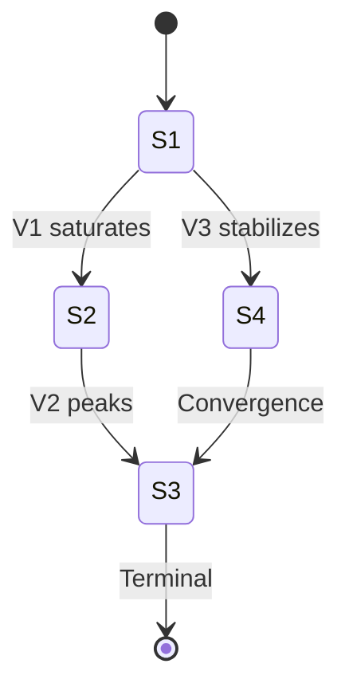

# Scenario Generation Algorithm

## Overview

Scenario generation systematically produces all consistent future states given a set of variables and their relationships. This document describes the algorithmic approach used in trend-based modeling.

## Input Requirements

### 1. Variable Set
Define the variables to model:
```
V = {V1, V2, V3, ..., Vn}
```

Each variable can take values from: `{INC, DEC, CONST}`

### 2. Relationship Matrix
Define pairwise relationships:
```
R(Vi, Vj) ∈ {+, -, 0}

+  : positive correlation
-  : negative correlation
0  : no correlation
```

### 3. Correlation Rules
How relationships constrain values:

**Positive Correlation (+)**:
```
INC(Vi) → INC(Vj)
DEC(Vi) → DEC(Vj)
CONST(Vi) → CONST(Vj)
```

**Negative Correlation (-)**:
```
INC(Vi) → DEC(Vj)
DEC(Vi) → INC(Vj)
CONST(Vi) → CONST(Vj)
```

---

## Generation Algorithm

### Brute Force Enumeration

```python
def generate_scenarios(variables, relationships):
    """Generate all consistent scenarios."""
    all_assignments = product([INC, DEC, CONST], repeat=len(variables))
    consistent_scenarios = []

    for assignment in all_assignments:
        if is_consistent(assignment, relationships):
            consistent_scenarios.append(assignment)

    return consistent_scenarios

def is_consistent(assignment, relationships):
    """Check if assignment satisfies all relationships."""
    for (vi, vj), correlation in relationships.items():
        if not satisfies_correlation(assignment[vi], assignment[vj], correlation):
            return False
    return True

def satisfies_correlation(val_i, val_j, correlation):
    """Check if two values satisfy their correlation."""
    if correlation == '+':
        return val_i == val_j
    elif correlation == '-':
        return (val_i == INC and val_j == DEC) or \
               (val_i == DEC and val_j == INC) or \
               (val_i == CONST and val_j == CONST)
    else:  # correlation == '0'
        return True  # no constraint
```

### Complexity Analysis

- **Total possible scenarios**: 3^n (where n = number of variables)
- **Consistent scenarios**: Depends on constraint density
- **Time complexity**: O(3^n × m) where m = number of relationships

### Optimization: Constraint Propagation

For large models, use constraint propagation:

1. Start with any assignment
2. Propagate implications through relationships
3. Detect contradictions early
4. Prune invalid branches

---

## Scenario Classification

### Terminal vs. Non-Terminal

**Terminal Scenario**: A stable equilibrium where no further changes occur.

Criteria:
- All relationships satisfied
- No external force driving change
- System in balance

**Non-Terminal Scenario**: A transitional state that will evolve.

Criteria:
- Unstable equilibrium
- Forces driving toward different state
- Temporary configuration

### Identifying Terminal Scenarios

```python
def is_terminal(scenario, external_forces):
    """Check if scenario is an equilibrium state."""
    for variable, value in scenario.items():
        force = external_forces.get(variable, CONST)
        if force != CONST and force != value:
            return False  # External force will cause change
    return True
```

---

## Transition Analysis

### Calculating Transitions

A transition occurs when a scenario evolves to another:

```
S1 → S2 requires:
1. S1 and S2 differ in at least one variable
2. The change is caused by some driver
3. The resulting S2 is consistent
```

### Transition Probability

While three-valued logic doesn't require probabilities, you can add:

```
P(S1 → S2) = f(driver_strength, time_horizon, barriers)
```

### Building Transition Graphs

```python
def build_transition_graph(scenarios, drivers):
    """Create graph of possible transitions."""
    graph = {}

    for s1 in scenarios:
        graph[s1] = []
        for s2 in scenarios:
            if can_transition(s1, s2, drivers):
                graph[s1].append((s2, transition_label(s1, s2, drivers)))

    return graph

def can_transition(s1, s2, drivers):
    """Check if transition from s1 to s2 is possible."""
    diff = variables_changed(s1, s2)
    if len(diff) == 0:
        return False  # Same scenario
    if len(diff) > 2:
        return False  # Too many simultaneous changes
    return has_driver_for_change(diff, drivers)
```

---

## Output Formats

### Scenario Table

| Scenario | V1 | V2 | V3 | V4 | Terminal? |
|----------|----|----|----|----|-----------|
| S1 | INC | INC | DEC | INC | No |
| S2 | CONST | INC | DEC | CONST | No |
| S3 | DEC | CONST | CONST | DEC | Yes |

### Mermaid Transition Diagram



### Scenario Narrative

```markdown
## Scenario S1: Growth Phase

**Configuration**: V1=INC, V2=INC, V3=DEC, V4=INC

**Description**: Early growth stage with expanding market,
increasing competition, declining margins, and rising innovation.

**Stability**: Non-terminal - will evolve as market matures.

**Likely Transitions**:
- → S2 when V1 saturates (market matures)
- → S4 when V3 stabilizes (margin floor reached)
```

---

## Practical Example

### E-commerce Market Model

**Variables**:
- M: Market Size
- C: Competition
- P: Prices
- T: Technology Investment

**Relationships**:
- M ↔ C: + (larger market, more competitors)
- M ↔ P: - (larger market, price pressure)
- C ↔ P: - (more competition, lower prices)
- T ↔ M: + (tech investment drives growth)

**Generated Scenarios**:

| # | M | C | P | T | Valid? | Terminal? |
|---|---|---|---|---|--------|-----------|
| 1 | INC | INC | DEC | INC | ✓ | No |
| 2 | DEC | DEC | INC | DEC | ✓ | Yes |
| 3 | CONST | CONST | CONST | CONST | ✓ | Yes |
| 4 | INC | DEC | DEC | INC | ✗ | - |

Scenario 4 is invalid: M=INC requires C=INC (positive correlation).

---

## References

Bočková, N., Volná, B., & Dohnal, M. (2025). "Optimisation of complex product innovation processes based on trend models with three-valued logic." *arXiv:2601.10768*.
