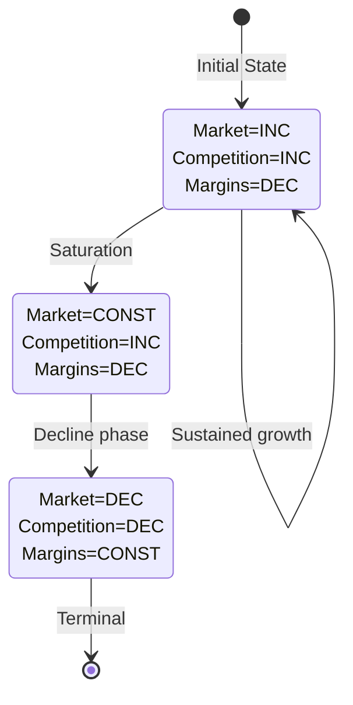

# Three-Valued Logic for Market Analysis

## Theoretical Foundation

Three-valued logic provides a framework for reasoning about systems when precise numerical data is unavailable. In market analysis, this enables meaningful insights with minimal information.

## Core Concepts

### The Three Values

| Value | Symbol | Meaning |
|-------|--------|---------|
| INC | ↑ or + | Increasing trend |
| DEC | ↓ or - | Decreasing trend |
| CONST | → or = | Constant/stable |

### Why Three Values?

From Bočková, Volná, & Dohnal (2025):
> "These are minimally information-intensive quantifiers... no numerical values of constants or parameters are needed."

**Benefits**:
- Works with limited data
- Captures directional relationships
- Easy to communicate
- Avoids false precision
- Enables qualitative reasoning

---

## Mathematical Basis

### Kleene's Three-Valued Logic

Originally developed for computability theory, three-valued logic handles uncertainty:

| Kleene | Market Analysis |
|--------|-----------------|
| True | INC (definitely increasing) |
| False | DEC (definitely decreasing) |
| Unknown | CONST (stable or uncertain) |

### Trend Calculus

Operations on trends:

**Addition (simultaneous effects)**:
| + | INC | CONST | DEC |
|---|-----|-------|-----|
| INC | INC | INC | ? |
| CONST | INC | CONST | DEC |
| DEC | ? | DEC | DEC |

Note: `?` indicates indeterminate - depends on relative magnitudes.

**Negation (inverse relationship)**:
| Value | Negation |
|-------|----------|
| INC | DEC |
| DEC | INC |
| CONST | CONST |

---

## Correlation to Trend Conversion

Transform correlation relationships into trend logic:

### Positive Correlation
If X and Y are positively correlated:
```
INC(X) → INC(Y)
DEC(X) → DEC(Y)
CONST(X) → CONST(Y)
```

**Example**: Market size and competition
- Larger markets attract more competitors
- If Market = INC, then Competition = INC

### Negative Correlation
If X and Y are negatively correlated:
```
INC(X) → DEC(Y)
DEC(X) → INC(Y)
CONST(X) → CONST(Y)
```

**Example**: Price and demand (elastic goods)
- Higher prices reduce demand
- If Price = INC, then Demand = DEC

---

## Extended Notation

### Rate of Change

| Code | Meaning | Description |
|------|---------|-------------|
| AG | Accelerating Growth | INC with increasing rate |
| DG | Decelerating Growth | INC with decreasing rate |
| AD | Accelerating Decline | DEC with increasing rate |
| DD | Decelerating Decline | DEC with decreasing rate |

### Second Derivative Analysis

```
AG: d²y/dt² > 0 while dy/dt > 0  (growth accelerating)
DG: d²y/dt² < 0 while dy/dt > 0  (growth slowing)
AD: d²y/dt² < 0 while dy/dt < 0  (decline accelerating)
DD: d²y/dt² > 0 while dy/dt < 0  (decline slowing)
```

---

## Building Trend Models

### Step 1: Define Variables

List market variables:
- Market Size (M)
- Competition Intensity (C)
- Price Levels (P)
- Innovation Rate (I)
- Customer Adoption (A)

### Step 2: Identify Relationships

For each pair, determine:
- Correlation direction (positive/negative)
- Strength (strong/weak)
- Time lag (if any)

### Step 3: Build Relationship Matrix

| Variable | M | C | P | I | A |
|----------|---|---|---|---|---|
| M (Market) | - | + | - | + | + |
| C (Competition) | + | - | - | + | 0 |
| P (Price) | - | - | - | - | - |
| I (Innovation) | + | + | - | - | + |
| A (Adoption) | + | 0 | - | + | - |

Legend: + positive correlation, - negative correlation, 0 no correlation

### Step 4: Generate Consistent Scenarios

Find variable assignments that satisfy all relationships:

```
Scenario 1: M=INC, C=INC, P=DEC, I=INC, A=INC
  ✓ M↔C: both INC (positive correlation satisfied)
  ✓ M↔P: M INC, P DEC (negative correlation satisfied)
  ... check all relationships
```

### Step 5: Identify Transitions

Map how scenarios can evolve:
- What changes would move from S1 to S2?
- What are the terminal (stable) scenarios?
- What triggers transitions?

---

## Practical Application

### Market Entry Analysis

**Variables**:
- Market Growth (MG)
- Competitive Intensity (CI)
- Entry Barriers (EB)
- Technology Maturity (TM)

**Relationships**:
- MG ↔ CI: positive (growth attracts competition)
- EB ↔ CI: negative (barriers reduce competition)
- TM ↔ EB: positive (mature tech has higher barriers)

**Generated Scenarios**:
1. **Growing Market**: MG=INC, CI=INC, EB=CONST, TM=INC
2. **Mature Equilibrium**: MG=CONST, CI=CONST, EB=INC, TM=CONST
3. **Declining Market**: MG=DEC, CI=DEC, EB=DEC, TM=CONST

### Trade-off Analysis

From the research:
> "No scenario satisfies all objective functions simultaneously."

Use trend logic to identify inherent trade-offs:
- Scenarios optimizing for growth vs. profit
- Scenarios favoring incumbents vs. entrants
- Scenarios prioritizing different stakeholders

---

## Visualization

### Trend State Diagram



---

## References

Bočková, N., Volná, B., & Dohnal, M. (2025). "Optimisation of complex product innovation processes based on trend models with three-valued logic." *arXiv:2601.10768*.

Kleene, S.C. (1952). *Introduction to Metamathematics*. North-Holland.
